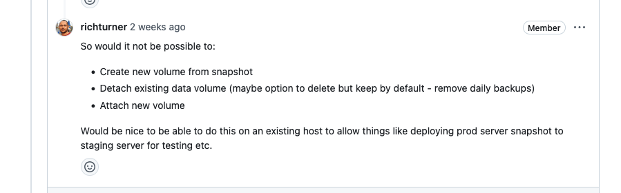

<!-- title: 4. Implementation: SSM Automations -->

## 4. Implementation: SSM Automations  <!-- omit in toc -->

## Context
This document provides a detailed overview how I implemented the automations on the `AWS` platform using `Amazon Systems Manager` (`SSM`)
It also outlines the decisions I made and the challenges encountered throughout the development process.

<div style="page-break-after: always;"></div>

## Contents <!-- omit in toc -->

- [Context](#context)
- [1. Research based on feedback](#1-research-based-on-feedback)
  - [1.1. Investigating SSM Automations](#11-investigating-ssm-automations)
- [2. Rewriting existing SSM documents using SSM automation](#2-rewriting-existing-ssm-documents-using-ssm-automation)
- [2.1. Attach Volume Document](#21-attach-volume-document)
  - [2.1.1. Get Instance Details](#211-get-instance-details)
  - [2.1.2. Attach Volume](#212-attach-volume)
  - [2.1.3. Wait For Volume Attachment](#213-wait-for-volume-attachment)
  - [2.1.4. Mount Volume](#214-mount-volume)
  - [2.1.5. Wait For Volume Mounting](#215-wait-for-volume-mounting)
  - [2.1.6. Update Tag](#216-update-tag)
- [2.2. Detach Volume Document](#22-detach-volume-document)
  - [2.2.1. Get Volume Details](#221-get-volume-details)
  - [2.2.1. Get Instance Details](#221-get-instance-details)

<div style="page-break-after: always;"></div>

## 1. Research based on feedback
After several iterations on the `EBS` data volume implementation, it is now nearly production-ready.
I've got one last comment to investigate if it's possible to create an automation to replace an existing `EBS` data volume with an snapshot.

### 1.1. Investigating SSM Automations
Currently, If an OpenRemote version update fails, we manually rollback the update by replacing the `root` volume with the latest snapshot. This manual process introduces downtime and takes a lot of time.

By automating this process, we can rollback much quicker which results in less downtime and on top of that we can update more frequently.



I already created some `SSM` documents for `attaching`, `detaching`, `mounting` and `umounting` the `EBS` data volume. Those documents are used for preparing the `EBS` data volume when provisioning the `EC2` instance for the host.

Despite the fact that these documents are working as expected, I'm not happy in the way the work. These (command) documents are interacting with the AWS API via `CLI` commands in `bash`. Unfortunately, they are executed asynchronously and don't wait for other commands before continuing. As a result of this, I need to implement several loops within the script to wait for a specific status before marking the execution of the command as `success`. I think this approach is to much error prone and not reliable enough to be used in an production environment.

To address this issue, I did some more extensive research on how `Amazon Systems Manager` (`SSM`) is working and which features it offers. 

I came across `SSM Automation`, a tool for automating deployment, maintenance and remediation tasks for a variety of AWS Services.
After exploring the documentation I found out that with these type of documents it is possible to interact with the AWS API natively using the action `aws:executeAwsApi`. With the action `aws:waitForAwsResourceProperty` you can wait for a variable to become a specific value, for example a `success` status. These automations are not executed asynchrously and wait for each other to complete with an `success` status before continuing. You can even control the next step that is being executed by providing the step name in the `nextStep` property.

This is exactly what we need, all the issues we have with normal `SSM` documents are solved by using `SSM` automations. Since this approach suites the best for our use case, I decided to give it a try by first rewriting the existing documents using `SSM` automation.

## 2. Rewriting existing SSM documents using SSM automation

## 2.1. Attach Volume Document
I started by rewriting the attach volume document, this is one of the documents that has the issues that `SSM` automation can solve.
The first part of the `SSM` automation documents look almost the same as the `command` documents. Except for the `DocumentType` and `schemaVersion` parameters, `SSM` automation uses `schemaVersion` `0.3` instead of `2.2`. The `DocumentType` must be set to `Automation`

```
SSMAttachVolumeDocument:
  Type: AWS::SSM::Document
  Properties:
    DocumentType: Automation
    DocumentFormat: YAML
    TargetType: /AWS::EC2::Instance
    Name: attach_volume
    Content:
      schemaVersion: '0.3'
      description: 'Script for attaching an EBS data volume'
      parameters:
        VolumeId:
          type: String
          description: '(Required) Specify the VolumeId of the volume that should be attached'
          allowedPattern: '^vol-[a-z0-9]{8,17}$'
        InstanceId:
          type: String
          description: '(Required) Specify the InstanceId of the instance where the volume should be attached'
          allowedPattern: '^i-[a-z0-9]{8,17}$'
        DeviceName:
          type: String
          description: '(Required) Specify the Device name where the volume should be mounted on'
          allowedPattern: '^/dev/sd[b-z]$'
```

The parameters are described the exact same way, no changes need to be made here.
This document have 3 different parameters:

- `VolumeId`: The `EBS` data volume that needs to be attached to the instance.
- `InstanceId`: The `EC2` instance where the `EBS` data volume needs to be attached.
- `DeviceName`: The `DeviceName` where the volume needs to be mounted on.

After the initial configuration, I started describing the different steps that need to be excuted in the `mainSteps` block. Instead of using the `aws:runShellScript` action and specify the commands in `bash` that are being executed on the targeted `EC2` machine, I specify the different AWS `API` actions by using the `aws:executeAwsApi` action.

### 2.1.1. Get Instance Details
The first step is to retrieve the `EC2` instance details using the `InstanceId` that is specified in the `parameters` section. This is handeled by the `DescribeInstances` API.

When the instance details are fetched, The `hostname` is retrieved by filtering the `tags` property and searching for the tag with the `Key==Name` . This value is pushed to the `outputs` section so it becomes available for the next steps.
The `hostname` variable is very important in this process as it is used in different places to reference the various `AWS` components, for example, to target the correct volume in the `DLM` policy for creating `snapshots`.

```
# Retrieve instance details to get the Host name.
- name: GetInstanceDetails
  action: aws:executeAwsApi
  timeoutSeconds: 120
  onFailure: Abort
  inputs:
   Service: ec2
   Api: DescribeInstances
   InstanceIds:
    - '{{ InstanceId }}'
  outputs:
    - Name: Host
      Selector: $.Reservations[0].Instances[0].Tags[?(@.Key == 'Name')].Value
      Type: String
   nextStep: AttachVolume
```
After this step is successfully executed, the automation will continue by executing the step provided in the `nextStep` parameter. In this case the `AttachVolume` step.

### 2.1.2. Attach Volume
After successfully retrieving the `hostname`, the `EBS` data volume can be attached to the instance specified in the `parameters` section.
The `EBS` data volume will be mounted on the specified `Devicename`, this can be any value between `/dev/sd[b]-[z]` as long as the `Devicename` is not already in used by another volume. The `/dev/sda` is reserved for the `root` device and cannot be used.

Because the next steps are dependent on this step, I added the `isCritical=true` parameter to ensure that the automation will only continue when this step is executed successfully. When the step failed, it automatically stops running the automation.
```
# Attach EBS data volume to specified instance
- name: AttachVolume
  action: aws:executeAwsApi
  timeoutSeconds: 120
  onFailure: Abort
  isCritical: true
  inputs:
    Service: ec2
    Api: AttachVolume
    VolumeId: '{{ VolumeId }}'
    InstanceId: '{{ InstanceId }}'
    Device: '{{ DeviceName }}'
  nextStep: WaitForVolumeAttachment
```

When the `EBS` data volume is successfully attached to the instance, the automation will continue by executing the `WaitForVolumeAttachment` step.

### 2.1.3. Wait For Volume Attachment
Once the `EBS` data volume is attached to the instance, it's important to check that the volume is correctly attached to the instance (`state=attached`). In the previous `SSM` command documents, I checked the status every 30 seconds by executing an `CLI` command in a `bash` while loop. With `SSM` automation, I can use the `aws:waitForAwsResourceProperty` action and check for an `AWS` resource to become a specific value. The step will wait until the value specified in the `DesiredValues` is retrieved.

In this case, I used the `DescribeVolumes` API to retrieve the volume details using the `VolumeId` specified in the `parameters` section. With the `PropertySelector` I target the volume's `state` parameter from the API `Response` object using the `JSONPath` notation.
With the `DesiredValues` I can specify the exact value that the parameter retrieved from the `PropertySelector` must have before the step is marked as `successfull` and continuing to the next step provided in the `nextStep` parameter.

When something goes wrong, the step will not receive the value specified in the `DesiredValues` parameter which eventually can lead to a infinite loop of waiting. Therefore, It's recommend to configure a timeout when using the `aws:waitForAwsResourceProperty` by providing the `timeoutSeconds` parameter. When no specific timeout is specified the default of 1 hour (`3600` seconds) will be used.

```
# Wait until the EBS data volume is successfully attached
- name: WaitForVolumeAttachment
  action: aws:waitForAwsResourceProperty
  timeoutSeconds: 120
  onFailure: Abort
  inputs:
   Service: ec2
   Api: DescribeVolumes
   VolumeIds:
     - '{{ VolumeId }}'
   PropertySelector: '$.Volumes[0].Attachments[0].State'
   DesiredValues:
     - attached
   nextStep: MountVolume
```

When the volume is in the `attached` state, the automation will continue by executing the `MountVolume` step.

### 2.1.4. Mount Volume
After successfully attaching the volume to the `EC2` instance it needs to be mounted to a `directory` before it can be used. After investigating the different `SSM` automation actions it turns out that executing `bash` commands directly on the `EC2` instance is currently not supported by `SSM` automations. The action `aws:executeScript` only allows `python` and `powershell` scripts to be executed within the automation. These scripts are used for processing more complex logic, but cannot run on `EC2` instances.

To mount the volume to the instance you must execute several `linux` commands directly on the `EC2` instance. To achieve this, I decided to use the existing `mount_volume` document that uses the `DocumentType` command. This document has support for running commands and scripts on the targeted `EC2` instance by using the `aws:runShellScript` action.

To execute the `mount_volume` document within the `SSM` automation, I use the `aws:runCommand` action. I specify the document that needs to be executed by configuring the `DocumentName` parameter. Parameters that can be configured within the document can be specified in the `Parameters` section by providing each individual parameter by its name. For mounting the volume there are 2 parameters required:

- `DeviceName`: The `DeviceName` where the volume needs to be mounted on.
- `InstanceIds`: The `EC2` instance where the `EBS` data volume needs to be attached.

The parameters for the `mount_volume` document are populated with the parameter values that are configured at the top of the automation document. They are filled in by the user when executing the automation and will be passed to the other documents when needed.

```
# Mount EBS data volume to specified instance
- name: MountVolume
  action: aws:runCommand
  timeoutSeconds: 120
  onFailure: Abort
  isCritical: true
  inputs:
   DocumentName: mount_volume
   Parameters:
    DeviceName:
        - '{{ DeviceName }}'
    InstanceIds:
        - '{{ InstanceId }}'
   nextStep: WaitForVolumeMounting
```

When the `mount_volume` document is successfully executed, it is important to check if the execution is succeeded. Therefore, in the next step, I will check for the execution status.

### 2.1.5. Wait For Volume Mounting
Before continuing to the next step, It is important to check if the `mount_volume` document has successfully executed all the commands that are described. In this step, I will use the `aws:waitForAwsResourceProperty` again to check for a specific value.
I used the `GetCommandInvocation` API to retrieve the invocation details from the `mount_volume` document by specifing the `CommandId` parameter with the `CommandId` from the previous step.

In the `PropertySelector`, I target the `StatusDetails` parameter from the API `Response` object to check for the document's execution status. In the `DesiredValues` parameter I specify that the value must be `Success` before moving to the next step.

```
# Wait until the EBS data volume is successfully mounted
- name: WaitForVolumeMounting
  action: aws:waitForAwsResourceProperty
  timeoutSeconds: 120
  onFailure: Abort
  inputs:
   Service: ssm
   Api: GetCommandInvocation
   CommandId: '{{ MountVolume.CommandId }}'
   InstanceId: '{{ InstanceId }}'
   PropertySelector: '$.StatusDetails'
   DesiredValues:
     - Success
   nextStep: UpdateTag
```

When the `mount_volume` document is successfully executed, the automation will continue to the next step. At this point, the volume is successfully attached and mounted to the targeted `EC2` instance.

### 2.1.6. Update Tag
The last step in this automation is updating one of the `tags` that are configured on the `EBS` data volume. When the `EBS` data volume is provisioned using the `provision host` CI/CD workflow, it creates an `DLM` policy for automatic snapshot creation.
Amazon Data Lifecycle manager uses `tags` to target the `volumes` or `instances` that should be covered by the policy. 

In the previous example, I configured the policy to look for the `Name` tag with the value `{Hostname}/data`, this setup was working fine, but is hard to maintain. When the `Name` tag gets updated, the name in the `AWS` management portal also changed, which makes it hard to identity the different volumes. On top of that, when `detaching` the volume, it should not be targeted by the `DLM` policy anymore. To achieve this, the tag needs to be updated and the `Name` tag is not suitable for this.

Therefore, I created a custom tag with the name `Type`. When creating the `EBS` data volume during the `provision host` CI/CD workflow, it will configure the tag with the value `or-data-not-in-use`. When the volume is attached to the instance, the tag will be updated with the value `or-data-in-use`. The `DLM` policy is configured to target only `volumes` with this tag. When the volume is detached from the `EC2` instance, the tag will be updated to `or-data-not-in-use` and therefore not be targeted by the policy anymore.

To make this approach more granular, I added the `hostname` in front of the `tag` value to make sure that the `DLM` policy is only targetting the volumes from a specific host. Otherwise, when multiple `hosts` are deployed within the same `AWS` account, multiple `DLM` policies are targetting the same `volumes`. This could result in multiple `snapshot` creations at the same time.

When the previous steps are successfully executed, the `UpdateTag` step will update the `tag` from the `EBS` data volume that is specified in the `ResourceIds` parameter to `or-data-in-use`. This ensures that the volume is targeted by the `DLM` policy and automatic snapshots are being created.

```
# Change tag to ensure the EBS data volume is targeted by the DLM policy
- name: UpdateTag
  action: aws:createTags
  timeoutSeconds: 120
  onFailure: Abort
  inputs:
   ResourceType: EC2
   ResourceIds: 
    - '{{ VolumeId }}'
   Tags:
    - Key: Type
      Value: '{{ GetInstanceDetails.Host }}-or-data-in-use'
```

## 2.2. Detach Volume Document
After rewriting the `attach_volume` document, I tested it and confirmed the solution was working as expected. Using `SSM` automation, the problems and bottlenecks that occur in the previous approach were solved and the solution is running stable with less problems. Becuase of the success, I decided to rewrite the `detach_volume` document as well.

The document uses the same `DocumentType` and `schemaVersion` as the previous automation. For detaching the volume, only an `VolumeId` is required. This is configured within the `parameters` section and can be filled in before running the automation.

```
Type: AWS::SSM::Document
Properties:
  DocumentType: Automation
  DocumentFormat: YAML
  TargetType: /AWS::EC2::Instance
  Name: detach_volume
  Content:
    schemaVersion: '0.3'
    description: 'Script for detaching an EBS data volume'
    parameters:
      VolumeId:
        type: String
        description: '(Required) Specify the VolumeId of the volume that should be detached'
        allowedPattern: '^vol-[a-z0-9]{8,17}$'
```

### 2.2.1. Get Volume Details
To make the document as simple as possible and to prevent errors because of wrong configuration, I decided to retrieve the `InstanceId` and `DeviceName` using the `VolumeId` specified in the `parameters` section at the top of this document. This ensures that the  values associated with the volume are automatically retrieved instead of manually entering them.

The volume details are retrieved using the `DescribeVolumes` API by specifying the `VolumeId` from the `parameters` section at the top. After successfully fetching the volume details the `DeviceName` and `InstanceId` parameters can be retrieved by targeting the parameters from the API `Response` object using the `JSONPath` notation. The parameters are then pushed to the `outputs` section so they can be used in the next steps.

```
# Retrieve EBS data volume details to get the DeviceName and InstanceId
- name: GetVolumeDetails
  action: aws:executeAwsApi
  timeoutSeconds: 120
  onFailure: Abort
  inputs:
    Service: ec2
    Api: DescribeVolumes
    VolumeIds:
      - '{{ VolumeId }}'
    outputs:
      - Name: DeviceName
        Selector: '$.Volumes[0].Attachments[0].Device'
      - Name: InstanceId
        Selector: '$.Volumes[0].Attachments[0].InstanceId'
  nextStep: GetInstanceDetails
```

After the volume details are successfully retrieved, the automation will continue to the next step.

### 2.2.1. Get Instance Details
The same as in the previous automation, 

```
# Retrieve instance details to get the Hostname
- name: GetInstanceDetails
  action: aws:executeAwsApi
  timeoutSeconds: 120
  onFailure: Abort
  inputs:
    Service: ec2
    Api: DescribeInstances
    InstanceIds:
      - '{{ GetVolumeDetails.InstanceId }}'
    outputs:
      - Name: Host
        Selector: $.Reservations[0].Instances[0].Tags[?(@.Key == 'Name')].Value
        Type: String
    nextStep: UmountVolume
```