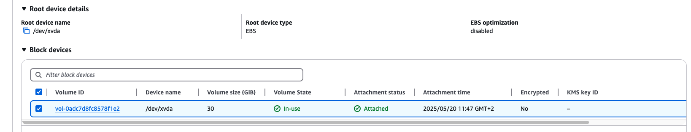
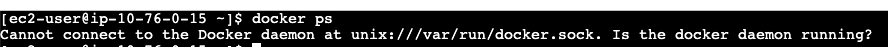

<!-- title: 5. Tests: Production AWS Account -->

## 5. Tests: Production AWS Account  <!-- omit in toc -->

## Context
This document provides a detailed description how I tested my `EBS` data volume implementation on OpenRemote's AWS account.

<div style="page-break-after: always;"></div>

## Contents <!-- omit in toc -->

- [Context](#context)
- [1. Configure AWS account](#1-configure-aws-account)
  - [1.1. Provisioning / Updating CloudFormation Stacks](#11-provisioning--updating-cloudformation-stacks)
  - [1.2. Updating IAM Roles](#12-updating-iam-roles)
- [2. Provisioning host](#2-provisioning-host)
- [3. Tests in the AWS account](#3-tests-in-the-aws-account)
  - [3.1. Deploying OpenRemote to the new host](#31-deploying-openremote-to-the-new-host)
  - [3.2. Testing Detach Volume](#32-testing-detach-volume)
    - [3.2.1. Volume is detached from the EC2 instance](#321-volume-is-detached-from-the-ec2-instance)
    - [3.2.2. Docker is successfully stopped](#322-docker-is-successfully-stopped)

<div style="page-break-after: always;"></div>

## 1. Configure AWS account
Before running the `CI/CD` workflow, I configured the `AWS` account with the required `IAM` policies and provisioned/updated several `CloudFormation` stacks.

### 1.1. Provisioning / Updating CloudFormation Stacks
First, I provisioned the `or-ssm` CloudFormation stack to ensure the `SSM` documents are available in `Amazon Systems Manager (SSM)`. When an new AWS account is provisioned using the `provision_account` workflow, these documents are automatically created during workflow execution. In this case the AWS account was already created. Therefore, I need to add these documents manually to ensure the workflow can execute them to attach/mount the `EBS` data volume to the instance.


I also updated the existing `or-dashboard-default` `CloudFormation` stack to make the `EBS` data volume visible on the `CloudWatch` Dashboard.

 \


### 1.2. Updating IAM Roles
In the `CI/CD` workflow, I've added the feature to create an `DLM` policy for automatic snapshot creation. Before this can be provisioned, the `IAM` role that's assumed by the `CI/CD` runner needs to have the approriate permissions.
I added the following permissions to the `developers-access-eu-west-1` role:

- `DLMPolicy (Inline)`
  - `dlm:CreateLifecyclePolicy` - To create the Amazon Data Lifecycle Manager policy for automatic snapshot creation.
  - `dlm:TagResource` - To tag the resources (volumes) that needs to be targeted by the `DLM` policy.
- `IAMPassRole (Inline)`
  - `arn:aws:iam::xxxxx:role/developers-access-eu-west-1` - To be able to pass this `IAM` role to the `DLM` service.
- `AWSDataLifecycleManagerServiceRole (Policy)` - To give `DLM` permissions to take actions on AWS resources, for example to create snapshots from the `EBS` data volume on behalf of the AWS user.

I also added the `DLM` service to the trusted entities to ensure `DLM` can assume this role.


## 2. Provisioning host
After configuring the AWS account, I was be able to run the `provision_host` workflow with my changes. Since the implementation is not merged in the `master` branch, I need to use the following `GitHub` CLI command to run the workflow from an different branch:

```
gh workflow run "provision host" --ref feature/ebs-volume-creation --field ACCOUNT_NAME=openremote --field HOST=dennis.openremote.app
```

The workflow provisiones a new host in the `openremote` AWS account with the hostname (FQDN) `dennis.openremote.app`. The following services are provisioned:
- An `EC2` instance configured with `Docker`, `Docker-Compose`
- An `EBS` Data Volume that's mounted to the `/var/lib/docker/volumes` directory
- An `DLM` policy for automatically create snapshots from the `EBS` data volume
- Several `CloudWatch` healthchecks to monitor the performance of the `EC2` instance and the OpenRemote platform
- An `S3` bucket for storing the `PGDUMP` PostgreSQL backup file

After approximately 5 minutes, the workflow has finished execution and the host is ready to be used.


## 3. Tests in the AWS account
After provisioning the host in the AWS account I can start testing the `EBS` volume implementation.

### 3.1. Deploying OpenRemote to the new host
When the `provision_host` workflow is successfully executed, it creates an empty `EC2` instance. Before I can test my implementation I need to deploy OpenRemote on this virtual machine.
I used the `CI/CD` workflow to deploy the branch `feature/edit-map-layers` to this instance. This takes around 10 minutes as it needs to build the `Docker` images first.

When this workflow is finished successfully, OpenRemote is running on the `EC2` instance and accessible using the hostname (`dennis.openremote.app`)


### 3.2. Testing Detach Volume
First, I tested the option to detach the `EBS` volume by executing the `detach_volume` `SSM` document using the `volumeId`. 
After the document is successfully executed I manually checked every step to make sure the tasks are executed correctly.


#### 3.2.1. Volume is detached from the EC2 instance
The `EBS` data volume is correctly detached from the EC2 instance. Only the `root` volume is still attached.



#### 3.2.2. Docker is successfully stopped
The `Docker` service and socket are successfully stopped. The `Docker` containers are no longer running and OpenRemote is shutdown safely



