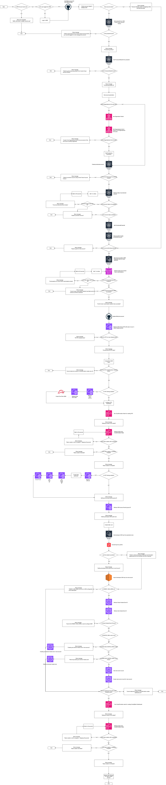

---
title: "CI/CD Workflow"
subtitle: "Decomposition"
author: [Dennis Catharina Johannes Kuijs]
date: "June 17, 2025"
lang: "en"
toc: true
toc-own-page: true
titlepage: true
titlepage-text-color: "FFFFFF"
titlepage-rule-color: "360049"
titlepage-rule-height: 0
titlepage-background: "config/document_background.pdf"
titlepage-logo: "config/logo.png"
logo-width: 35mm
footer-left: "OpenRemote"
footer-center: "\\theauthor"
code-block-font-size: "\\scriptsize"
...

# 1. Context
This document provides an overview of the flowcharts I created to decomposite the `CI/CD` workflow. By visualizing this into a flowchart I've got a better understanding how the `CI/CD` workflow is functioning.

# 2. Flowchart: Provision Account

The picture below visualizes the working of the `provision account` bash script. The bash script will be executed when the `provision account` workflow get triggered by a manual `workflow dispatch`.
This script creates an AWS account for the customer within the AWS account from OpenRemote using AWS `Organizations`. After the account is created the script will provision and configure several components such as the `VPC`, `SSH Key`, `CloudWatch` Dashboards and `Route53` for domain management.

# 3. Flowchart: Provision Host

The picture below visualizes the working of the `provision host` bash script. The bash script will be executed when the `provision host` workflow get triggered by a manual `workflow dispatch`
This script provisions an `EC2` instance within the customers AWS account. The instance will be used for running OpenRemote on AWS.

