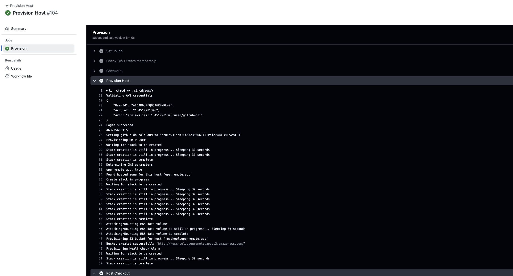
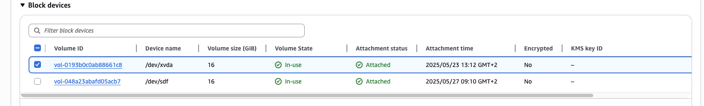
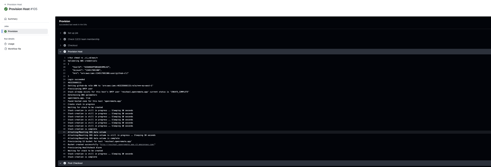
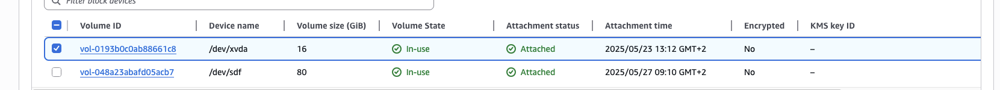
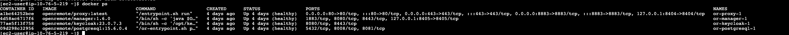

---
title: "AWS Production Instance"
subtitle: "Migration"
author: [Dennis Catharina Johannes Kuijs]
date: "June 17, 2025"
lang: "en"
toc: true
toc-own-page: true
titlepage: true
titlepage-text-color: "FFFFFF"
titlepage-rule-color: "360049"
titlepage-rule-height: 0
titlepage-background: "config/document_background.pdf"
titlepage-logo: "config/logo.png"
logo-width: 35mm
footer-left: "OpenRemote"
footer-center: "\\theauthor"
code-block-font-size: "\\scriptsize"
...

# 1. Context
This document provides a detailed description how I migrated a production instance to use the new `EBS` data volume implementation

# 2. Provisioning Host
The first step in this process is to provision a new instance using the `CI/CD` workflow. 
I configured the `EBS` data volume to use the same amount of storage as the current instance. The `root` volume will be provisioned with `16` GB of data. This is more than enough since only the operating system and a few linux packages are installed on this block device.



The workflow has been executed successfully and provisioned the new host (`reschool.openremote.app`) in the AWS account. Unfortunately, I encountered a problem with the `EBS` data volumes. They are being provisioned with the default amount of storage (both `16` GB) instead of the values provided in the workflow.
After investigating the issue, I found out that the parameters from the workflow are not being passed to the `CloudFormation` template. Therefore, the script automatically uses the default values.



I added the parameters to the `CloudFormation` template in the `provision_host` script as shown below.

```sh
 PARAMS="$PARAMS ParameterKey=RootDiskSize,ParameterValue=$ROOT_DISK_SIZE"
 PARAMS="$PARAMS ParameterKey=DataDiskSize,ParameterValue=$DATA_DISK_SIZE"
```

After the bugfix was merged into the main codebase, I deleted the `CloudFormation` stack for this host and rerun the `CI/CD` workflow.



Approxmately 5 minutes after starting the workfow it has been successfully executed again and the `EBS` data volumes are provisioned with the correct amount of storage.



The instance has been successfully provisioned and is ready to be used.


# 3. Migrating data from the current instance to the new instance
After successfully provisioning the new production instance it's time to migrate the data. The current production instance is still being used by many customers. Therefore, it is important to execute these steps with caution to prevent downtime as much as possible.

## 3.1. Creating snapshot from current instance
The first step in this process is to manally create a snapshot from the current instance. With this snapshot, we can create a new `EBS` data volume and attach it to the new instance to safely move the data without the risk of data loss on the production instance.
Since it's the first snapshot from this instance, it will be a `full snapshot` which takes a little longer to create since there is no existing snapshot to compare with.

After 1.5 hours, the snapshot has been created successfully.


To avoid issues with the production instance, we’ve decided to temporarily disable the `agent` that connects all `P1` meters for `5` minutes in order to refresh the snapshot. This process is quick as the system compares the existing snapshot with the current data and only adds any missing information. Within `30` seconds, the snapshot is updated, and the `agent` is re-enabled.
Disabling the agent results in a `5-minute` downtime, but it ensures that the new snapshot includes an `agent` asset marked as `disabled`. As a result, when we start the `Docker` containers on the new instance, the agent will remain disabled and won’t interfere with the current production environment. This is super important as the `MQTT` broker is configured to sent messages to only one `subscriber`.


## 3.2. Creating EBS data volume based off snapshot
After creating the snapshot, it's time to provision a new `EBS` data volume to move the `Docker` volumes to the new production instance. The `EBS` data volume is provisioned in the same `availability zone` as the new instance to ensure it can be attached without any issues.
When the volume is provisioned, it has been attached to the new instance.


## 3.3. Moving the Docker volumes directory

### 3.3.1. Creating Temporary Folder

When the `EBS` data volume is attached to the instance it first needs to be mounted to a directory. The directory must be different from the one where the files are copied to.
I created a temporary directory named `staging` using the following command:

```sh
sudo mkdir /staging
```

### 3.3.2. Mounting snapshot volume to temporary folder

Thereafter, I mounted the `EBS` data volume with the instance data to this directory with the following command: 

```sh
mount -t xfs -o nouuid /dev/nvme1n1 /staging
```

Since this snapshot is taken from a `root` volume, you need to specify which filesystem is used, that the `UUID` check can be ignored and you need to mount the block device using the current `block device name` instead of the `device name`

### 3.3.3. Removing or_proxy-data Docker volume

After the `EBS` data volume is mounted to the `/staging` directory we can check the contents of the `Docker` volumes directory using the following command:

```sh
sudo ls /staging/var/lib/docker/volumes
```

We need to copy all `Docker` persistent volumes except the `or_proxy-data` volume. This volume contains an outdated `SSL` certificate tied to the current production hostname, which can't be used on the new machine. When we deployed OpenRemote to the new instance via the `CI/CD` workflow, it automatically created a new `or_proxy-data` volume with the correct `SSL` certificate.
Before copying the volumes, I first removed the `or_proxy-data` volume using the command:

```sh 
sudo rm -rf /staging/var/lib/docker/volumes/or_proxy-data
```

### 3.3.1. Stopping Docker

I also disabled the `Docker` socket and service to make sure the containers are not running while modifying the persistens volumes. I used the `systemctl` command for this action

```sh
sudo systemctl start docker.service docker.socket
```

### 3.3.2. Copying Docker volumes using RSync

When the `proxy` volume is removed, we can start copying the `Docker` volumes to the new `EBS` data volume mounted at `/var/lib/docker/volumes` using the built-in `rsync` command from linux.
I have used the `rsync` command with the following options:

```sh
sudo rsync -avx --progress /staging/var/lib/docker/volumes /var/lib/docker/volumes
```

- `-a (archive mode)` It copies the files with the exact same file permissions, modification times, symbolic links etc.
- `-v (verbose mode)` It shows what `rsync` is doing by visualizing the log messages
- `-x (one filesystem)` It only copies files from the same filesystem, it doesn't copy files from mounted drives inside the directory

After the `Docker` volumes are copied to the `/var/lib/docker/volumes` directory. I checked the directory contents using

```sh
sudo ls /var/lib/docker/volumes
```

### 3.3.3. Restarting Docker

When everything is copied correctly, I started the `Docker` service and socket again using the command

```sh
sudo systemctl start docker.service and docker.socket
```

The `Docker` containers are booting up again and after 5 minutes all the containers are healthy.



# 4. Testing instance
When the `Docker` containers are successfully running again. I tested OpenRemote by visiting the hostname (`staging.openremote.app`). I immediately recognised that the `keycloak` theme has been changed


After logging into the instance using the `username` and `password`, all the `assets`, `rules`, `users` etc. are available again. The `agent` is still disabled, which confirmed that the snapshot was taken correctly.
All the data is successfully migrated and the instance is now available to be used in production

