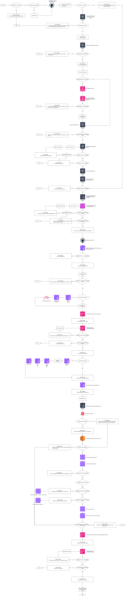
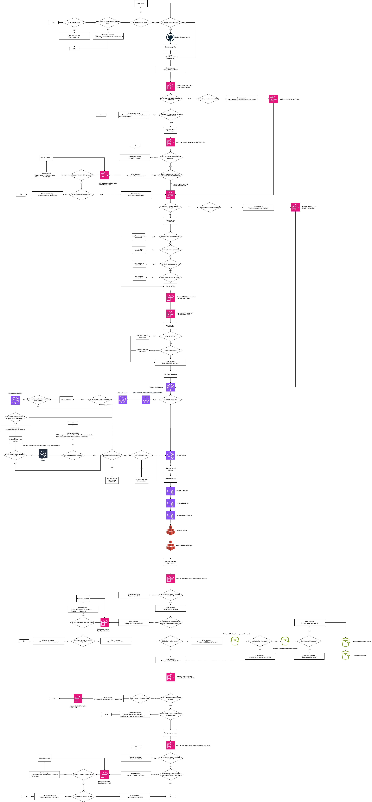

<!-- title: Decomposition CI/CD pipeline -->

## Decomposition CI/CD pipeline  <!-- omit in toc -->

## Context
This document provides an overview of the flowcharts I created to decomposite the CI/CD pipeline. By visualizing this into a flowchart I've got a better understanding how the CI/CD pipeline is functioning.

## Contents <!-- omit in toc -->

- [Context](#context)
- [1. Flowchart: Provision Account](#1-flowchart-provision-account)
- [2. Flowchart: Provision Host](#2-flowchart-provision-host)

## 1. Flowchart: Provision Account

The picture below visualizes the working of the `provision account` bash script. The bash script will be executed when the `provision account` workflow get triggered by a manual `workflow dispatch`

## 2. Flowchart: Provision Host

The picture below visualizes the working of the `provision host` bash script. The bash script will be executed when the `provision host` workflow get triggered by a manual `workflow dispatch`

