<!-- title: Implementation: Separate EBS Volume -->

## Implementation: Separate EBS Volume for storing/decoupling the IoT Data  <!-- omit in toc -->

## Context
This document provides a detailed overview of how I implemented the creation and mounting of the separate EBS volume within the CI/CD pipeline. It also outlines the decisions I made and the challenges encountered throughout the development process.

## Contents <!-- omit in toc -->

<div class="toc">

- [Context](#context)
- [1. Research based on feedback](#1-research-based-on-feedback)
  - [1.1. Mount EBS volume on the Docker volumes directory](#11-mount-ebs-volume-on-the-docker-volumes-directory)
- [2. Implementation in the CI/CD pipeline](#2-implementation-in-the-cicd-pipeline)
  - [2.1. Creating/Mounting the EBS data volume](#21-creatingmounting-the-ebs-data-volume)
    - [2.1.1. GitHub Actions Workflow](#211-github-actions-workflow)
    - [2.1.2. Provision Host Script](#212-provision-host-script)
    - [2.1.3. CloudFormation Template](#213-cloudformation-template)
  - [2.2. Adding CloudWatch metrics/alarms for the EBS data volume](#22-adding-cloudwatch-metricsalarms-for-the-ebs-data-volume)
    - [2.2.1. CloudFormation Template](#221-cloudformation-template)
  - [2.3. Adding support for automatic snapshot creation of the EBS data volume](#23-adding-support-for-automatic-snapshot-creation-of-the-ebs-data-volume)
    - [2.3.1. Provision Host Script](#231-provision-host-script)
    - [2.3.2. CloudFormation Template](#232-cloudformation-template)
  - [2.4. Adding support for automatic attaching/detaching the EBS data volume](#24-adding-support-for-automatic-attachingdetaching-the-ebs-data-volume)
    - [2.4.1. Provision Host Script](#241-provision-host-script)
    - [2.4.2. CloudFormation Template](#242-cloudformation-template)
- [3. Improved implementation based on feedback](#3-improved-implementation-based-on-feedback)
  - [3.1. Add counter when attaching volume](#31-add-counter-when-attaching-volume)
  - [3.2. Stop Docker before unmounting/detaching the volume](#32-stop-docker-before-unmountingdetaching-the-volume)
  - [3.3. Wait until EC2 instance is created before attaching/mounting the volume](#33-wait-until-ec2-instance-is-created-before-attachingmounting-the-volume)
  - [3.4. SSM Documents for each account instead of host](#34-ssm-documents-for-each-account-instead-of-host)
  - [3.5. Improve check if filesystem exists](#35-improve-check-if-filesystem-exists)
  - [3.6. Problems with auto-reloader.conf](#36-problems-with-auto-reloaderconf)
  - [3.7. Attaching volume within the provision host script](#37-attaching-volume-within-the-provision-host-script)
  - [3.8. Move provisioning DLM Policy to create-ec2 stack](#38-move-provisioning-dlm-policy-to-create-ec2-stack)
  - [3.9. Move provisioning EBS data volume to create-ec2 stack](#39-move-provisioning-ebs-data-volume-to-create-ec2-stack)

</div>

## 1. Research based on feedback
After completing my initial research, I shared my findings with several team members. Following their feedback, I continued my research on this topic before proceeding with the implementation of my prototype in the CI/CD pipeline.

### 1.1. Mount EBS volume on the Docker volumes directory
One of the team members suggested mounting the default `Docker` volumes directory (`/var/lib/docker/volumes`) to the newly created `EBS` volume, rather than creating and mounting a custom directory.
I began investigating this option by mounting the separate `EBS` volume to this directory using the following command:

```sh
sudo mount /dev/sdf /var/lib/docker/volumes
```

This works without any issues, when I checked the volume mount points using the following command.

```sh
sudo lsblk -f
```

It shows that the volume is mounted on `Docker's` default volume location (`/var/lib/docker/volumes`)


After starting OpenRemote with the default `Docker Compose` file, everything booted up properly without any issues.

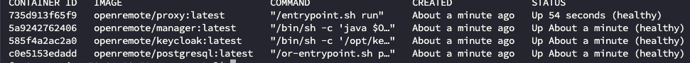

However, after attaching the `EBS` volume to another `EC2` instance running OpenRemote, I encountered permission errors with the `PostgresSQL` container once again.

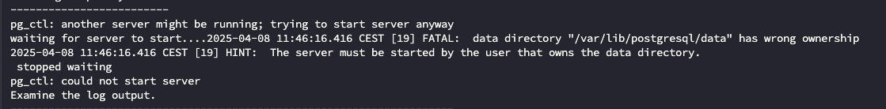

Based on the insights of my initial research, I knew that this issue could be resolved by setting the `PGDATA` environment variable in the `Docker Compose` file. \
Since the `EBS` volume is an external block device, this step is nessecary for `Docker` to properly access the data. It's not possible to `chown` the directory to both the `postgres` and `root` users simultaneously, which makes specifying the `PGDATA` variable essential.

After adding the `PGDATA` variable the `Docker Compose` file looks like this.

```
# OpenRemote v3
#
# Profile that runs the stack by default on https://localhost using a self-signed SSL certificate,
# but optionally on https://$OR_HOSTNAME with an auto generated SSL certificate from Letsencrypt.
#
# It is configured to use the AWS logging driver.
#
volumes:
  proxy-data:
  manager-data:
  postgresql-data:

services:

  proxy:
    image: openremote/proxy:${PROXY_VERSION:-latest}
    restart: always
    depends_on:
      manager:
        condition: service_healthy
    ports:
      - 80:80 # Needed for SSL generation using letsencrypt
      - ${OR_SSL_PORT:-443}:443
      - 8883:8883
      - 127.0.0.1:8404:8404 # Localhost metrics access
    volumes:
      - proxy-data:/deployment
    environment:
      LE_EMAIL: ${OR_EMAIL_ADMIN:-}
      DOMAINNAME: ${OR_HOSTNAME:-localhost}
      DOMAINNAMES: ${OR_ADDITIONAL_HOSTNAMES:-}
      # USE A CUSTOM PROXY CONFIG - COPY FROM https://raw.githubusercontent.com/openremote/proxy/main/haproxy.cfg
      # HAPROXY_CONFIG: '/data/proxy/haproxy.cfg'

  postgresql:
    restart: always
    image: openremote/postgresql:${POSTGRESQL_VERSION:-latest}
    shm_size: 128mb
    volumes:
      - postgresql-data:/var/lib/postgresql/data
      - manager-data:/storage
    environment:
      PGDATA: /var/lib/postgresql/data/postgres

  keycloak:
    restart: always
    image: openremote/keycloak:${KEYCLOAK_VERSION:-latest}
    depends_on:
      postgresql:
        condition: service_healthy
    volumes:
      - ./deployment:/deployment
    environment:
      KEYCLOAK_ADMIN_PASSWORD: ${OR_ADMIN_PASSWORD:-secret}
      KC_HOSTNAME: ${OR_HOSTNAME:-localhost}
      KC_HOSTNAME_PORT: ${OR_SSL_PORT:--1}


  manager:
  # privileged: true
    restart: always
    image: openremote/manager:${MANAGER_VERSION:-latest}
    depends_on:
      keycloak:
        condition: service_healthy
    ports:
      - 127.0.0.1:8405:8405 # Localhost metrics access
    environment:
      OR_SETUP_TYPE:
      OR_ADMIN_PASSWORD:
      OR_SETUP_RUN_ON_RESTART:
      OR_EMAIL_HOST:
      OR_EMAIL_USER:
      OR_EMAIL_PASSWORD:
      OR_EMAIL_X_HEADERS:
      OR_EMAIL_FROM:
      OR_EMAIL_ADMIN:
      OR_METRICS_ENABLED: ${OR_METRICS_ENABLED:-true}
      OR_HOSTNAME: ${OR_HOSTNAME:-localhost}
      OR_ADDITIONAL_HOSTNAMES:
      OR_SSL_PORT: ${OR_SSL_PORT:--1}
      OR_DEV_MODE: ${OR_DEV_MODE:-false}

      # The following variables will configure the demo
      OR_FORECAST_SOLAR_API_KEY:
      OR_OPEN_WEATHER_API_APP_ID:
      OR_SETUP_IMPORT_DEMO_AGENT_KNX:
      OR_SETUP_IMPORT_DEMO_AGENT_VELBUS:
    volumes:
      - manager-data:/storage
```

With this setup, the `EBS` volume can now easily be attached to other `EC2` instances as long as the `PGDATA` variable is configured on both the original and target machine.
Additionally, the `Docker Compose` file becomes much simpeler, only the `PGDATA` variable needs to be configured, eliminating the need to define different volume paths for each individual container.

## 2. Implementation in the CI/CD pipeline
In this section, I will explain how I implemented my prototype into the existing CI/CD pipeline on `Github Actions`. It will be devided into the following topics.
  
  - Creating/Mounting the `EBS` data volume
  - Adding CloudWatch metrics/alarms for the `EBS` data volume
  - Adding support for automatic snapshot creation of the `EBS` data volume
  - Adding support for automatic attaching/detaching the `EBS` data volume

### 2.1. Creating/Mounting the EBS data volume

#### 2.1.1. GitHub Actions Workflow
I start my implementation in the `GitHub Actions` workflow file. In this file the steps for executing the CI/CD pipeline are defined.
The workflow is triggered on `workflow dispatch`, meaning it runs on-demand without the need for a pull-request or code push.

```
on:
  workflow_dispatch:
```

I added two additional input variables to this file: `DATA_DISK_SIZE` and `SNAPSHOT_ID`.

The `DATA_DISK_SIZE` variable allows you to specify the desired size of `EBS` data volume. By default, it is set to 16, matching the size of the `root` device.
```
DATA_DISK_SIZE:
  description: 'Override EC2 data EBS volume size (GB)'
    type: string
    default: '16'
    required: false
```

The `SNAPSHOT_ID` variable allows you to specify a `Snapshot` to create the `EBS` data volume, enabling you to create a volume based on an existing snapshot.
When this variable is specified the `DATA_DISK_SIZE` parameter is ignored. Instead, the volume will be provisioned with the same amount of storage that was assigned before snapshot creation.

```
SNAPSHOT_ID:
  description: 'Create EBS data volume based on snapshot'
  type: string
  required: false
```

Next, I added the input variables to the `.env` section in the `provision host` step. This ensures that the variable values can be accessed by referencing the input section at the top, as show below:

```
  env:
    ACCOUNT_NAME: ${{ github.event.inputs.ACCOUNT_NAME }}
    HOST: ${{ github.event.inputs.HOST }}
    INSTANCE_TYPE: ${{ github.event.inputs.INSTANCE_TYPE }}
    ROOT_DISK_SIZE: ${{ github.event.inputs.ROOT_DISK_SIZE }}
    DATA_DISK_SIZE: ${{ github.event.inputs.DATA_DISK_SIZE }}
    SNAPSHOT_ID: ${{ github.event.inputs.SNAPSHOT_ID }}
    ELASTIC_IP: ${{ github.event.inputs.ELASTIC_IP }}
    PROVISION_S3_BUCKET: ${{ github.event.inputs.PROVISION_S3_BUCKET }}
    AWS_ACCESS_KEY_ID: ${{ secrets._TEMP_AWS_ACCESS_KEY_ID }}
    AWS_SECRET_ACCESS_KEY: ${{ secrets._TEMP_AWS_SECRET_ACCESS_KEY }}
    AWS_ROLE_NAME: ${{ secrets._TEMP_AWS_ROLE_NAME }}
    ENABLE_METRICS: ${{ github.event.inputs.ENABLE_METRICS }}
```

Finally, I passed the newly created variables to the `provision host` script. This ensures that the script can access the variable values and execute its logic based on them.

```
.ci_cd/aws/provision_host.sh "$ACCOUNT_NAME" "$HOST" "$INSTANCE_TYPE" "$ROOT_DISK_SIZE" "$DATA_DISK_SIZE" "$SNAPSHOT_ID" "$ELASTIC_IP" "$PROVISION_S3_BUCKET" "$ENABLE_METRICS"
```

#### 2.1.2. Provision Host Script
In the `provision host` script, I modified the order of the variables passed from the `workflow` to the script. In Bash, you can reference each variable based on the order in which they are passed.

```
AWS_ACCOUNT_NAME=${1,,}
HOST=${2,,}
INSTANCE_TYPE=${3,,}
ROOT_DISK_SIZE=${4,,}
DATA_DISK_SIZE=${5,,}
SNAPSHOT_ID=${6,,}
ELASTIC_IP=${7,,}
PROVISION_S3_BUCKET=${8,,}
ENABLE_METRICS=${9,,}
WAIT_FOR_STACK=${10,,}
```

Next, I created the `EBS_STACK_NAME` variable, which generates a unique name for the `CloudFormation` stack by combining the `STACK_NAME` with a predefined text string. The `STACK_NAME` itself is created from the `HOST` variable, where all dots in the `hostname` are replaced with a separator. With this apparoach, the `CloudFormation` stack names are unique for every `host`.

It is crucial that the `EBS` volume is created in the same `Availabilty Zone` as the `EC2` instance, as the volume cannot be attached to the instance otherwise. To ensure this, I first investigated how the `EC2` instance is assigned to a specific `Availabilty Zone`.

First, the `SUBNET_NUMBER` variable is set to a random integer between 1 and 3. There are 3 different `public subnets` and this apparoach randomly selects one of them. Each subnet is located in a different `Availabilty Zone` (`1a`, `1b` or `1c`). The subnet name is then generated using the `SUBNET_NUMBER` variable and a predefined text string.

```
SUBNET_NUMBER=$(( $RANDOM % 3 + 1 ))
SUBNETNAME="or-subnet-public-$SUBNET_NUMBER"
```

I still needed the exact `Availabilty Zone` name that the `EC2` instance will use. The script already includes a line that retrieves the `AvailabiltyZoneId` based on the `SUBNET_NAME` variable. However, this ID cannot be used to to create the `EBS` volume, as the volume requires the `Availabilty Zone` name, not the ID, to resolve this, I added the following line to the script to retrieve the name.

```
SUBNET_AZ=$(aws ec2 describe-subnets --filters Name=tag:Name,Values=$SUBNETNAME --query "Subnets[0].AvailabilityZone" --output text $ACCOUNT_PROFILE 2>/dev/null)
```

After setting the `Availabilty Zone` name in the `SUBNET_AZ` variable I can begin creating the `EBS` data volume. 
The volume creation is handeled by a seperate `CloudFormation` template to ensure that the `EBS` data volume will not be affected by updates to the `EC2` instance template. 

Before creating the `EBS` data volume, I first check if the stack not already exists.

```
STATUS=$(aws cloudformation describe-stacks --stack-name $EBS_STACK_NAME --query "Stacks[0].StackStatus" --output text 2>/dev/null)

if [ -n "$STATUS" ] && [ "$STATUS" != 'DELETE_COMPLETE' ]; then
    echo "Stack already exists for this host '$HOST' current status is '$STATUS'"
    EBS_STACK_ID=$(aws cloudformation describe-stacks --stack-name $EBS_STACK_NAME --query Stacks[0].StackId --output text 2>/dev/null)
else
```

If the stack exists, the `EBS_STACK_ID` variable will be set with the `Stack ID` for future reference. Otherwise, the `EBS` data volume is created.
Before creating the volume, I first check if the `CloudFormation` template exists in one of the specified directories. If the template is not found, the script will exit and throw an error.

```
if [ -f "${awsDir}cloudformation-create-ebs-volume.yml" ]; then
  EBS_TEMPLATE_PATH="${awsDir}cloudformation-create-ebs-volume.yml"
  elif [ -f ".ci_cd/aws/cloudformation-create-ebs-volume.yml" ]; then
  EBS_TEMPLATE_PATH=".ci_cd/aws/cloudformation-create-ebs-volume.yml"
    lif [ -f "openremote/.ci_cd/aws/cloudformation-create-ebs-volume.yml" ]; then
  EBS_TEMPLATE_PATH="openremote/.ci_cd/aws/cloudformation-create-ebs-volume.yml"
  else
    echo "Cannot determine location of cloudformation-create-ebs-volume.yml"
    exit 1
fi
```

Next, I set the `HOST`, `AvailabilityZone` and `DiskSize` parameters that are specified in the `CloudFormation` template to create the volume. These values are either provided by the `workflow` inputs or generated earlier in the script.

```
PARAMS="ParameterKey=Host,ParameterValue=$HOST"
PARAMS="$PARAMS ParameterKey=AvailabilityZone,ParameterValue=$SUBNET_AZ"
PARAMS="$PARAMS ParameterKey=DiskSize,ParameterValue=$DATA_DISK_SIZE"
```

When the `SNAPSHOT_ID` variable is provided, this parameter will be configured to ensure that the volume is created based of an existing snapshot.

```
if [ -n "$SNAPSHOT_ID" ]; then
  PARAMS="$PARAMS ParameterKey=SnapshotId,ParameterValue='$SNAPSHOT_ID'"
fi
```

After configuring the parameters, the `CloudFormation` stack will be created with the following command. 
In this command I specify the stack name that was generated at the beginning of the script and pass the configured parameters.

```
EBS_STACK_ID=$(aws cloudformation create-stack --capabilities CAPABILITY_NAMED_IAM --stack-name $EBS_STACK_NAME --template-body file://$EBS_TEMPLATE_PATH --parameters $PARAMS --output text)
```

When the stack is successfully created, it returns the `Stack ID`, which is then be stored in the `EBS_STACK_ID` variable. 
The code below checks whether the stack creation command succeeded. If not, the script will trhow an exit code and stop execution.

```
if [ $? -ne 0 ]; then
  echo "Create stack failed"
  exit 1
else
  echo "Create stack in progress"
fi
```

After the stack is successfully created, we need to check whether the creation was succesful or failed with an error. The code below retrieves the status from the `CloudFormation` stack based off the `Stack ID`  stored in the previous step. As long as the status returns `CREATE_IN_PROGRESS` the stack is still being created. The script checks the stack status every 30 seconds and stops when the status either returns `CREATE_COMPLETE` (indicating successful stack creation) or when the status is neither `CREATE_IN_PROGRESS` nor `CREATE_COMPLETE` (indicating stack creation failure).

```
    echo "Waiting for stack to be created"
    STATUS=$(aws cloudformation describe-stacks --stack-name $EBS_STACK_NAME --query "Stacks[?StackId=='$EBS_STACK_ID'].StackStatus" --output text 2>/dev/null)

    while [[ "$STATUS" == 'CREATE_IN_PROGRESS' ]]; do
        echo "Stack creation is still in progress .. Sleeping 30 seconds"
        sleep 30
        STATUS=$(aws cloudformation describe-stacks --stack-name $EBS_STACK_NAME --query "Stacks[?StackId=='$EBS_STACK_ID'].StackStatus" --output text 2>/dev/null)
    done

    if [ "$STATUS" != 'CREATE_COMPLETE' ]; then
        echo "Stack creation has failed status is '$STATUS'"
        exit 1
    else
        echo "Stack creation is complete"
    fi
```

When the `EBS` data volume is succesfully created, it can be attached to the `EC2` instance. To attach the volume to the instance, you must specify a `Device Name` such as `/dev/sda`, `/dev/sdb` etc. It is not possible to automatically assign a `device name` when attaching the volume. You must specify a specific `device name` upfront. To achieve this, I configured a variable named `EBS_DEVICE_NAME` and set it to `/dev/sdf` as the designated `device name`.

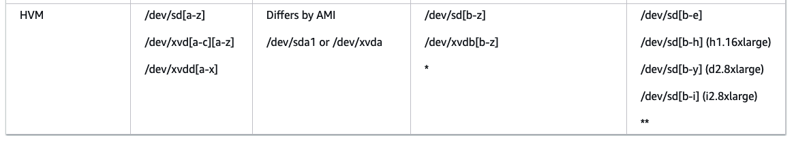

As shown in the image above, for `EC2` instances that are using `HVM` as the virtualization method, it is recommended to choose a `device name` between `/dev/sd[b]` and `/dev/sd[z]`.

Attaching the volume to the `EC2` instance is a technical process that involves several logical steps. 
First, before the `EBS` data volume can be mounted there must of course be a running `EC2` instance. To check this I retrieve the `Instance ID` and state from the `CloudFormation` stack that creates the `EC2` instance.

```
INSTANCE_ID=$(aws ec2 describe-instances --filters "Name=tag:Name,Values='$HOST'" --query "Reservations[].Instances[?Tags[?Value=='$STACK_ID']].InstanceId" --output text $ACCOUNT_PROFILE 2>/dev/null)
INSTANCE_STATE=$(aws ec2 describe-instances --filters "Name=tag:Name,Values='$HOST'" --query "Reservations[].Instances[?Tags[?Value=='$STACK_ID']].State.Name" --output text $ACCOUNT_PROFILE 2>/dev/null)
```

The script checks for an `EC2` instance associated to the `CloudFormation` template by querying the specifc `Stack ID` that was returned when this stack was successfully created. To ensure that we always target the correct instance, a filter is applied to retrieve the instance with the name provided in the `CloudFormation` template.
The script also retrieves the instance's status, as volume can only be attached to an instance that is in the `running` state.

```
echo "Check if instance is available"
count=0
while [[ -z "$INSTANCE_ID" ]] && [[ "$INSTANCE_STATE" != 'running' ]] && [ $count -lt 30 ]; do
    echo "Instance creation is still in progress .. Sleeping 30 seconds"
    sleep 30 
    INSTANCE_ID=$(aws ec2 describe-instances --filters "Name=tag:Name,Values='$HOST'" --query "Reservations[].Instances[?Tags[?Value=='$STACK_ID']].InstanceId" --output text $ACCOUNT_PROFILE 2>/dev/null)
    INSTANCE_STATE=$(aws ec2 describe-instances --filters "Name=tag:Name,Values='$HOST'" --query "Reservations[].Instances[?Tags[?Value=='$STACK_ID']].State.Name" --output text $ACCOUNT_PROFILE 2>/dev/null)
    count=$((count+1))
done
```

If the `Instance ID` is not found or the instance status is not `running`, the script waits for 30 seconds before retrying. Each attempt increments a counter, and the script continues checking as long as the counter remains below 30. This counter acts as a safeguard, in case the instance fails to launch successfully. If the counter exceeds 30, the script will stop prevent running indefinitely.

```
if [ -z "$INSTANCE_ID" ] && [ "$INSTANCE_STATE" != 'running' ]; then
  echo "Failed to provision instance"
  exit 1
fi
```

If the `Instance ID` cannot be retrieved or the instance state is not `running` after 30 retry attempts, the script will exit with an error status code.

Once the `Instance ID` is found and the instance is in a `running` state, the script attempts to attach the `EBS` data volume to the `EC2` instance. It's crucial that this step happens immediately after the instance becomes available, as several `cfn-scripts` begin running right after instance creation. One of these scripts automatically creates a filesystem on the volume and mounts it to the `/var/lib/docker/volumes` directory. If the volume isn’t attached in time, this step will fail, which then fails instance creation and therefore automatic rollbacks the `CloudFormation` stack.

After retrieving the `Instance ID` the script is trying to retrieve the `Volume ID` that belongs to the volume that was created by the `EBS` `CloudFormation` template. 

```
VOLUME_ID=$(aws ec2 describe-volumes --filters "Name=tag:Name,Values='$HOST/data'" --query "Volumes[?Tags[?Value=='$EBS_STACK_ID']].VolumeId" --output text $ACCOUNT_PROFILE 2>/dev/null)
```

Once the `Volume ID` is found, the system attempts to attach the volume using the following command. 

```
VOLUME=$(aws ec2 attach-volume --device $DEVICE_NAME --instance-id $INSTANCE_ID --volume-id $VOLUME_ID --output text $ACCOUNT_PROFILE 2>/dev/null)
```
The command includes the configured `device name` from the previous step, the `Instance ID` to which the volume will be attached, and the ID of the volume itself.
Immediately after, the status of the volume is retrieved to check if it has been successfully attached. If the volume is not attached, the script waits for 30 seconds before retrying.

```
while [[ "$STATUS" == 'attaching' ]]; do
    echo "Volume is still attaching .. Sleeping 30 seconds"
    sleep 30
    STATUS=$(aws ec2 describe-volumes --filters "Name=tag:Name,Values='$HOST/data'" --query "Volumes[?Tags[?Value=='$EBS_STACK_ID']].Attachments[].State" --output text $ACCOUNT_PROFILE 2>/dev/null)
done
```

When the status of the volume is `ATTACHED` the volume is attached succesfully to the instance. If the status is anything else, the attachment failed, and the script will exit with an error status code.

```
if [ "$STATUS" != 'attached' ]; then
    echo "Volume attaching failed with status $STATUS"
    exit 1
else
    echo "Volume attaching is complete"
fi

```

After the `EBS` data volume is successfully attached to the `EC2` instance, the script waits for all `cfn-scripts` to complete execution on the instance. These scripts handle several tasks, including creating a filesystem on the attached volume and mounting it to `Docker's` default directory at `/var/lib/docker/volumes`. Additionally, the script update the `/etc/fstab` file to ensure that the volume is automatically mounted on reboot using the device's `UUID` instead of the `device name`. This approach also prevents issues when attaching the same volume to an other `EC2` instance.

```
prepare_volume:
  commands:
    01_mount_volume:
      command: !Sub |
        if [ -n "${SnapshotId}" ]; then
          sudo mount "${EBSDeviceName}" /var/lib/docker/volumes
        else
          sudo mkfs -t xfs "${EBSDeviceName}"
          sudo mount "${EBSDeviceName}" /var/lib/docker/volumes
        fi
    02_configure_fstab:
        command: !Sub |
          UUID=$(sudo blkid -o value -s UUID "${EBSDeviceName}")
          if [ -n $UUID ]; then
            sudo cp /etc/fstab /etc/fstab.orig
            sudo echo "UUID=$UUID /var/lib/docker/volumes xfs defaults,nofail 0 2" >> /etc/fstab
          else
            echo "Failed to create /etc/fstab entry. UUID is not found"
            exit 1
          fi
```

#### 2.1.3. CloudFormation Template

The `CloudFormation` template for creating the `EBS` volume looks like this:

```

AWSTemplateFormatVersion: '2010-09-09'
Description: 'Creates an EBS Volume for storing the IoT data.'
Parameters:
  Host:
    Description: The hostname of the machine where this volume is being attached.
    Type: String
  AvailabilityZone:
    Description: The AZ where the EBS volume needs to be created.
    Type: String
  DiskSize:
    Description: Amount of storage you want to provision for this EBS volume.
    Type: Number
    Default: 16
  SnapshotId:
    Description: Snapshot ID to create the EBS volume based of an existing Snapshot.
    Type: String
    Default: ""

Conditions:
  IsSnapshotProvided: !Not [!Equals [!Ref SnapshotId, ""]]

Resources:
  ORDataVolume:
    Type: AWS::EC2::Volume
    Properties:
      AvailabilityZone: !Ref AvailabilityZone
      Size: !Ref DiskSize
      VolumeType: gp3
      SnapshotId: !If [IsSnapshotProvided, !Ref SnapshotId, !Ref 'AWS::NoValue']
      Tags:
        - Key: Name
          Value: !Sub ${Host}/data
```

The script will create aan `EBS` volume based on the parameters that are passed from the `provision host` script. To easily identify each volume, a tag will be added with the host's name.
If the condition `IsSnapshotProvided` is true, the `Snapshot ID` will be configured and the volume will based off an existing snaphost. Otherwise, an empty volume will be created.

### 2.2. Adding CloudWatch metrics/alarms for the EBS data volume

#### 2.2.1. CloudFormation Template
To monitor the performance and health of the `EBS` data volume, I added `CloudWatch` metrics and alarms for this device. 

As part of the `cfn-scripts` the `Cloudwatch Agent` will be configured to collect various metrics from the `EC2` machine such as `CPU utilization`, `memory usage`, `disk usage` and more. The script looks like this:

```
                  {
                    "agent":{
                      "metrics_collection_interval": 300
                    },
                    "metrics": {
                      "append_dimensions": {
                        "InstanceId": "${aws:InstanceId}"
                      },
                      "metrics_collected": {
                        "mem": {
                          "measurement": [
                            "mem_used_percent"
                          ],
                          "metrics_collection_interval": 900
                        },
                        "disk": {
                          "drop_device": true,
                          "measurement": [
                            "used_percent"
                          ],
                          "resources": [
                            "/",
                            "/var/lib/docker/volumes"
                          ],
                          "metrics_collection_interval": 900
                        }
                      }
                    },
                    "logs": {
                      "metrics_collected": {
                        "prometheus": {
                          "log_group_name": "Prometheus",
                          "prometheus_config_path": "/opt/aws/amazon-cloudwatch-agent/var/prometheus.yaml",
                          "emf_processor": {
                            "metric_declaration_dedup": true,
                            "metric_namespace": "CWAgent-Prometheus",
                            "metric_unit": {
                              "artemis_message_count": "Count",
                              "artemis_messages_added": "Count",
                              "or_rules_seconds_max": "Seconds",
                              "or_rules_seconds_sum": "Seconds",
                              "or_rules_seconds_count": "Count",
                              "or_attributes_seconds_max": "Seconds",
                              "or_attributes_seconds_sum": "Seconds",
                              "or_attributes_seconds_count": "Count",
                              "or_attributes_total": "Count",
                              "or_provisioning_seconds_max": "Seconds",
                              "or_provisioning_seconds_sum": "Seconds",
                              "or_provisioning_seconds_count": "Count",
                              "executor_pool_size_threads": "Count",
                              "executor_pool_core_threads": "Count",
                              "executor_pool_max_threads": "Count",
                              "executor_seconds_count": "Count",
                              "executor_seconds_sum": "Seconds",
                              "haproxy_server_current_sessions": "Count",
                              "haproxy_server_bytes_in_total": "Bytes",
                              "haproxy_server_bytes_out_total": "Bytes",
                              "haproxy_server_status": "Count",
                              "haproxy_server_http_responses_total": "Count",
                              "haproxy_server_max_session_rate": "Count/Second",
                              "haproxy_server_total_time_average_seconds": "Seconds"
                            },
                            "metric_declaration": [
                              {
                                "source_labels": [ "job" ],
                                "label_matcher": "^manager$",
                                "dimensions": [
                                  [ "InstanceName" ]
                                ],
                                "metric_selectors": [
                                  "^or_rules_seconds_count$",
                                  "^or_rules_seconds_sum$",
                                  "^or_rules_seconds_max$",
                                  "^or_attributes_seconds_count$",
                                  "^or_attributes_seconds_sum$",
                                  "^or_attributes_seconds_max$",
                                  "^or_provisioning_seconds_count$",
                                  "^or_provisioning_seconds_sum$",
                                  "^or_provisioning_seconds_max$"
                                ]
                              },
                              {
                                "source_labels": [ "job", "source" ],
                                "label_matcher": "manager;(RulesEngine|AgentService|DefaultMQTTHandler|AssetResource|WebsocketClient)",
                                "dimensions": [
                                  [ "InstanceName", "source" ]
                                ],
                                "metric_selectors": [
                                  "^or_attributes_total$"
                                ]
                              },
                              {
                                "source_labels": [ "job", "name" ],
                                "label_matcher": "^manager;ContainerExecutor$",
                                "dimensions": [
                                  [ "InstanceName","name" ]
                                ],
                                "metric_selectors": [
                                  "^executor_pool_",
                                  "^executor_seconds_count$",
                                  "^executor_seconds_sum$"
                                ]
                              },
                              {
                                "source_labels": [ "job" ],
                                "label_matcher": "^manager$",
                                "dimensions": [
                                  [ "InstanceName","queue" ]
                                ],
                                "metric_selectors": [
                                  "^artemis_message_count$",
                                  "^artemis_messages_added$"
                                ]
                              },
                              {
                                "source_labels": [ "job" ],
                                "label_matcher": "^proxy$",
                                "dimensions": [
                                  [ "InstanceName", "proxy", "server" ]
                                ],
                                "metric_selectors": [
                                  "^haproxy_server_total_time_average_seconds$",
                                  "^haproxy_server_max_session_rate$",
                                  "^haproxy_server_bytes",
                                  "^haproxy_server_current_sessions$"
                                ]
                              },
                              {
                                "source_labels": [ "job" ],
                                "label_matcher": "^proxy$",
                                "dimensions": [
                                  [ "InstanceName", "proxy", "server", "code" ]
                                ],
                                "metric_selectors": [
                                  "^haproxy_server_http_responses_total$"
                                ]
                              },
                              {
                                "source_labels": [ "job" ],
                                "label_matcher": "^proxy$",
                                "dimensions": [
                                  [ "InstanceName", "proxy", "server", "state" ]
                                ],
                                "metric_selectors": [
                                  "^haproxy_server_status$"
                                ]
                              }
                            ]
                          }
                        }
                      }
                    }
                  }

```

To monitor disk usage, I added the mount point for the new `EBS` volume to the `resources` block. 
This ensures that the `CloudWatch Agent` retrieves metrics for this specific mount point.

```
"drop_device": true,
"measurement": [
  "used_percent"
],
"resources": [
  "/",
  "/var/lib/docker/volumes"
],
```

Next, I added a new `CloudWatch Alarm` to the same `CloudFormation` template. This alarm is set to trigger if disk usage exceeds `90%` within a one-hour period. When the alarm is triggered, Amazon sends a notification to the configured `SNS` topic, which in turn sends an email alert to the topic's subscribers.
To connect the newly added metric to this alarm, I configured the `Dimensions` block with the required details, including the `Instance ID`, the path that is referring to the mount point in the metrics and the `Volume Type`.

```
DataDiskUtilizationAlarm:
  Type: AWS::CloudWatch::Alarm
  Condition: MetricsEnabled
  Properties:
    Namespace: CWAgent
    MetricName: disk_used_percent
    Statistic: Average
    Period: 3600
    EvaluationPeriods: 1
    ComparisonOperator: GreaterThanThreshold
    Threshold: 90
    AlarmActions:
      - !Ref SnsTopic
    OKActions:
      - !Ref SnsTopic
    Dimensions:
      - Name: InstanceId
        Value: !Ref EC2Instance
      - Name: path
        Value: /var/lib/docker/volumes
      - Name: fstype
        Value: xfs
```

### 2.3. Adding support for automatic snapshot creation of the EBS data volume

#### 2.3.1. Provision Host Script
To ensure that the data on the `EBS` data volume is securely backed up, the `provision host` script creates an `Amazon Data Lifecycle Manager (DLM)` policy for automatic snapshot creation. This policy ensures that snapshots of the `EBS` data volume is automatically created at regular intervals.
To maintain consistency throughout the script, I implemented this feature in the same way as the `EBS` data volume creation.

I began by setting the `DLM_STACK_NAME` variable to generate an unique `CloudFormation` stack name for this feature.

```
DLM_STACK_NAME="$STACK_NAME-dlm-ebs-snapshot-policy"
```

Next, the script checks if the `CloudFormation` stack for the `DLM` policy already exists, if it does, the `STACK_ID` variable is set for future reference and the script will continue with the next steps.

```
if [ -n "$STATUS" ] && [ "$STATUS" != 'DELETE_COMPLETE' ]; then
  echo "Stack already exists for this host '$HOST' current status is '$STATUS'"
  STACK_ID=$(aws cloudformation describe-stacks --stack-name $DLM_STACK_NAME --query "Stacks[0].StackId" --output text 2>/dev/null)
else
```

If the `CloudFormation` stack does not exists, the script will attempt to create it by first searching for the `CloudFormation` template within the specified directories. If the `CloudFormation` template cannot be found, the system wil exit with an error status code, Otherwise the stack creation process will proceed.

```
  if [ -f "${awsDir}cloudformation-create-dlm-policy.yml" ]; then
    DLM_TEMPLATE_PATH="${awsDir}cloudformation-create-dlm-policy.yml"
  elif [ -f ".ci_cd/aws/cloudformation-create-dlm-policy.yml" ]; then
    DLM_TEMPLATE_PATH=".ci_cd/aws/cloudformation-create-dlm-policy.yml"
  elif [ -f "openremote/.ci_cd/aws/cloudformation-create-dlm-policy.yml" ]; then
    DLM_TEMPLATE_PATH="openremote/.ci_cd/aws/cloudformation-create-dlm-policy.yml"
  else
    echo "Cannot determine location of cloudformation-create-dlm-policy.yml"
    exit 1
  fi
```

Before the stack can be created, the script first checks if the required `IAM` role is already created in the AWS account. This role is necessary for the `DLM` policy to perform snapshot creation tasks on behalf of the `IAM` user.
If the role doesn't exists, the system will create the default role and set the `ROLE_ARN` variable with the `Amazon Resource Name` (ARN). This variable will then be passed to the `CloudFormation` template in the next step.

```
echo "Check if IAM Role exists"
ROLE_ARN=$(aws iam get-role --role-name AWSDataLifecycleManagerDefaultRole --query "Role.Arn" --output text $ACCOUNT_PROFILE)

if [ -z "$ROLE_ARN" ]; then
  ROLE=$(aws dlm create-default-role --resource-type snapshot)
      
  if [ $? -ne 0 ]; then
    echo "IAM Role creation has failed"
    exit 1
  else
    echo "IAM Role creation is complete"
  fi
      
  ROLE_ARN=$(aws iam get-role --role-name AWSDataLifecycleManagerDefaultRole --query "Role.Arn" --output text $ACCOUNT_PROFILE)
fi
```

After configuring the `ROLE_ARN` variable, the script sets the necessary variables for the `CloudFormation` template. The `DLM_DESCRIPTION` variable is constructed by combining the `HOST` variable and removing any periods, as they are not allowed in the description. Additionally, the `ROLE_ARN` retrieved in the previous step is set, along with the `EBS_STACK_ID`, which identifies the volume that the policy should target.

```
DLM_DESCRIPTION="OpenRemote-${HOST%.*}"
PARAMS="ParameterKey=PolicyDescription,ParameterValue='$DLM_DESCRIPTION'"
PARAMS="$PARAMS ParameterKey=DLMExecutionRoleArn,ParameterValue='$ROLE_ARN'"
PARAMS="$PARAMS ParameterKey=EBSStackId,ParameterValue='$EBS_STACK_ID'"
```

Once the parameters are configured, the script attempts to create the `CloudFormation` stack. If the stack creation fails, the script will exit with an error code and stops execution.

```
STACK_ID=$(aws cloudformation create-stack --capabilities CAPABILITY_NAMED_IAM --stack-name $DLM_STACK_NAME --template-body file://$DLM_TEMPLATE_PATH --parameters $PARAMS --output text)

if [ $? -ne 0 ]; then
  echo "Create stack failed"
  exit 1
fi
```

After the `CloudFormation` stack is successfully created, the script checks its status every 30 seconds. If the status returns `CREATE_COMPLETE`, the stack was created successfully, and the script proceeds to the next steps. However, if the status is neither `CREATE_IN_PROGRESS` nor `CREATE_COMPLETE`, it indicates an error, and the script will exit with an error code and stop execution.

```
  if [ "$WAIT_FOR_STACK" != 'false' ]; then
    # Wait for CloudFormation stack status to be CREATE_*
    echo "Waiting for stack to be created"
    STATUS=$(aws cloudformation describe-stacks --stack-name $DLM_STACK_NAME --query "Stacks[?StackId=='$STACK_ID'].StackStatus" --output text 2>/dev/null)

    while [[ "$STATUS" == 'CREATE_IN_PROGRESS' ]]; do
        echo "Stack creation is still in progress .. Sleeping 30 seconds"
        sleep 30
        STATUS=$(aws cloudformation describe-stacks --stack-name $DLM_STACK_NAME --query "Stacks[?StackId=='$STACK_ID'].StackStatus" --output text 2>/dev/null)
    done

    if [ "$STATUS" != 'CREATE_COMPLETE' ]; then
        echo "Stack creation has failed status is '$STATUS'"
        exit 1
    else
        echo "Stack creation is complete"
    fi
  fi
```

#### 2.3.2. CloudFormation Template

The `CloudFormation` template for creating the `DLM` policy looks like this:

```

Parameters:
  PolicyDescription:
    Description: Lifecycle Policy Description
    Type: String
  DLMExecutionRoleArn:
    Description: Role ARN for executing the DLM operations.
    Type: String
  EBSStackId:
    Description: EBS StackId of the volume that need to be targeted by this policy.
    Type: String

Resources:
  EBSPolicy:
    Type: AWS::DLM::LifecyclePolicy
    Properties:
      Description: !Ref PolicyDescription
      ExecutionRoleArn: !Ref DLMExecutionRoleArn
      State: ENABLED
      PolicyDetails:
        PolicyLanguage: STANDARD
        PolicyType: EBS_SNAPSHOT_MANAGEMENT
        TargetTags:
          - Key: aws:cloudformation:stack-id
            Value: !Ref EBSStackId
        ResourceTypes: 
          - VOLUME
        Schedules:
          - Name: Daily Backup
            CreateRule:
              Interval: 24
              IntervalUnit: HOURS
              Times:
              - '05:00'
            RetainRule:
              Count: 5

```

The script creates a `lifecycle policy` with a single schedule that triggers a new snapshot every `24 hours` at `5 AM`. The `RetainRule` is configured to keep the 5 most recent snapshots, automatically deleting older ones beyond that limit. The policy is enabled immediately upon creation.
To ensure that snapshots are only created for the correct volume, the `TargetTags` parameter uses the `EBS_STACK_ID` value to identify the appropriate volume.

### 2.4. Adding support for automatic attaching/detaching the EBS data volume

#### 2.4.1. Provision Host Script
The final step in the process is to create two scripts for automatically attaching and detaching the `EBS` data volume. These scripts are stored in `Amazon Systems Manager` and can be executed either manually through the AWS Management Console or via the AWS `CLI`.
To provision the `SSM` scripts, I reused the same logic applied when provisioning the `EBS` data volume and `DLM` policy in the `provision host` script.

First, I added a new variable at the beginning of the script to generate the `CloudFormation` stack name.

```
SSM_STACK_NAME="$STACK_NAME-ssm-attach-detach-documents"
```

Next, the script checks if the `CloudFormation` stack for generating the `SSM` documents already exists.

```
echo "Provisioning SSM Documents for attaching/detaching EBS Data volume"
STATUS=$(aws cloudformation describe-stacks --stack-name $SSM_STACK_NAME --query "Stacks[0].StackStatus" --output text 2>/dev/null)

if [ -n "$STATUS" ] && [ "$STATUS" != 'DELETE_COMPLETE' ]; then
  echo "Stack already exists for this host '$HOST' current status is '$STATUS'"
  STACK_ID=$(aws cloudformation describe-stacks --stack-name $SSM_STACK_NAME --query "Stacks[0].StackId" --output text 2>/dev/null)
else
```

If the stack already exists, the `STACK_ID` variable will be set with the `Stack ID` for furture reference. Otherwise, the script continues with the stack creation process.
The first step in this process is to verify whether the `CloudFormation` template for creating the `SSM` documents exists within the specified directories.

```
if [ -f "${awsDir}cloudformation-create-ssm-document" ]; then
  SSM_TEMPLATE_PATH="${awsDir}cloudformation-create-ssm-document.yml"
elif [ -f ".ci_cd/aws/cloudformation-create-ssm-document.yml" ]; then
  SSM_TEMPLATE_PATH=".ci_cd/aws/cloudformation-create-ssm-document.yml"
elif [ -f "openremote/.ci_cd/aws/cloudformation-create-ssm-document.yml" ]; then
  SSM_TEMPLATE_PATH="openremote/.ci_cd/aws/cloudformation-create-ssm-document.yml"
else
  echo "Cannot determine location of cloudformation-create-ssm-document.yml"
  exit 1
fi
```

If the template is not found, the script exits with an error code and stops execution. Otherwise, it proceeds to configure the required parameters for provisioning the `SSM` documents.
The `CloudFormation` template required several values such as the `INSTANCE_ID`, `VOLUME_ID` `DEVICE_NAME` and `HOST`, which are used within the scripts to handle the attachment and detachment of the `EBS` volume.

```
PARAMS="ParameterKey=Host,ParameterValue='$HOST'"
PARAMS="$PARAMS ParameterKey=InstanceId,ParameterValue='$INSTANCE_ID'"
PARAMS="$PARAMS ParameterKey=VolumeId,ParameterValue='$VOLUME_ID'"
PARAMS="$PARAMS ParameterKey=EBSDeviceName,ParameterValue='$DEVICE_NAME'"
```

After setting the parameters, the script attempts to create the `CloudFormation` stack.

```
STACK_ID=$(aws cloudformation create-stack --capabilities CAPABILITY_NAMED_IAM --stack-name $SSM_STACK_NAME --template-body file://$SSM_TEMPLATE_PATH --parameters $PARAMS --output text)
```

If stack creation fails, the system will throw an error code and stops execution.

```
if [ $? -ne 0 ]; then
  echo "Create stack failed"
  exit 1
fi
```

After the stack is successfully created, the script waits for the stack creation process to complete if the `WAIT_FOR_STACK` variable is set to true. During this time, it checks the stack status every 30 seconds and returns a success once the status changes to `CREATE_COMPLETE`. If the status is neither `CREATE_IN_PROGESS` nor `CREATE_COMPLETE`, it indicates that the stack creation has failed. In that case, the script exits with an error code and stops execution.

```
if [ "$WAIT_FOR_STACK" != 'false' ]; then
  # Wait for CloudFormation stack status to be CREATE_*
  echo "Waiting for stack to be created"
  STATUS=$(aws cloudformation describe-stacks --stack-name $SSM_STACK_NAME --query "Stacks[?StackId=='$STACK_ID'].StackStatus" --output text 2>/dev/null)

  while [[ "$STATUS" == 'CREATE_IN_PROGRESS' ]]; do
      echo "Stack creation is still in progress .. Sleeping 30 seconds"
      sleep 30
      STATUS=$(aws cloudformation describe-stacks --stack-name $SSM_STACK_NAME --query "Stacks[?StackId=='$STACK_ID'].StackStatus" --output text 2>/dev/null)
  done

  if [ "$STATUS" != 'CREATE_COMPLETE' ]; then
      echo "Stack creation has failed status is '$STATUS'"
      exit 1
  else
      echo "Stack creation is complete"
  fi
fi
```

#### 2.4.2. CloudFormation Template
The `CloudFormation` template for provisioning the `SSM` documents looks like this:

```
AWSTemplateFormatVersion: '2010-09-09'
Description: 'Creates an SSM Document for attaching/detaching the EBS volume'

Parameters:
  Host:
    Description: FQDN for host.
    Type: String
  InstanceId:
    Description: InstanceId where the script needs to be executed.
    Type: String
  VolumeId:
    Description: VolumeId that needs to be attached/detached.
    Type: String
  EBSDeviceName:
    Description: EBS DeviceName where this volume is mounted on.
    Type: String

Resources:
  SSMDetachEBSDocument:
    Type: AWS::SSM::Document
    Properties:
         Content:
            schemaVersion: '2.2'
            description: 'Script for detaching the EBS volume'
            parameters:
              InstanceId:
                type: String
                description: InstanceId where the script needs to be executed.
                default: !Ref InstanceId
              VolumeId:
                type: String
                description: VolumeId that needs to be detached.
                default: !Ref VolumeId
              EBSDeviceName:
                  type: String
                  description: EBS DeviceName where this volume is mounted on.
                  default: !Ref EBSDeviceName
            mainSteps:
              - name: RemoveFstabEntry
                action: aws:runShellScript
                inputs:
                  runCommand: 
                    - |
                      UUID=$(sudo blkid -o value -s UUID {{ EBSDeviceName }})
                      if [ -n "$UUID" ]; then
                        cp /etc/fstab /etc/fstab.orig
                        sed -i '/UUID='$UUID'/d' /etc/fstab
                      else
                        echo "Failed to remove /etc/fstab entry. UUID is not found"
                        exit 1
                      fi
              - name: StopDocker
                action: aws:runShellScript
                inputs:
                    runCommand:
                      - systemctl stop docker
              - name: UmountVolume
                action: aws:runShellScript
                inputs:
                  runCommand:
                    - umount {{ EBSDeviceName }}
              - name: DetachVolume
                action: aws:runShellScript
                inputs:
                  runCommand: 
                    - |
                      VOLUME=$(aws ec2 detach-volume --volume-id {{ VolumeId }})
                      STATUS=$(aws ec2 describe-volumes --query "Volumes[?VolumeId=='{{ VolumeId }}'].State" --output text 2>/dev/null)
                      
                      while [[ "$STATUS" == 'in-use' ]] do
                        echo "Instance is still in-use .. Sleeping 30 seconds"
                        sleep 30
                        STATUS=$(aws ec2 describe-volumes --query "Volumes[?VolumeId=='{{ VolumeId }}'].State" --output text 2>/dev/null)
                      done

                      if [ "$STATUS" != "available" ]; then
                        echo "Failed to detach volume"
                        exit 1
                      fi
         DocumentFormat: YAML
         TargetType: /AWS::EC2::Instance
         UpdateMethod: Replace
         DocumentType: Command
         Name: !Sub ${Host}_detach
  
  SSMAttachEBSDocument:
    Type: AWS::SSM::Document
    Properties:
         Content:
            schemaVersion: '2.2'
            description: 'Script for attaching the EBS volume'
            parameters:
              InstanceId:
                type: String
                description: InstanceId where the script needs to be executed.
                default: !Ref InstanceId
              VolumeId:
                type: String
                description: VolumeId that needs to be attached.
                default: !Ref VolumeId
              EBSDeviceName:
                  type: String
                  description: EBS DeviceName where this volume needs to be mounted on.
                  default: !Ref EBSDeviceName
            mainSteps:
              - name: AttachVolume
                action: aws:runShellScript
                inputs:
                  runCommand:
                    -  |
                       VOLUME=$(aws ec2 attach-volume --device {{ EBSDeviceName }} --instance-id {{ InstanceId }} --volume-id {{ VolumeId }})
                       STATUS=$(aws ec2 describe-volumes --query "Volumes[?VolumeId=='{{ VolumeId }}'].Attachments[].State" --output text 2>/dev/null)
                       
                       while [[ "$STATUS" == 'attaching' ]] do
                          echo "Volume is still attaching .. Sleeping 30 seconds"
                          sleep 30
                          STATUS=$(aws ec2 describe-volumes --query "Volumes[?VolumeId=='{{ VolumeId }}'].Attachments[].State" --output text 2>/dev/null)
                       done

                       if [ "$STATUS" != 'attached' ]; then
                          echo "Volume attaching failed with status $STATUS"
                          exit 1
                       else
                          echo "Volume attaching is complete"
                       fi
                      
              - name: MountVolume
                action: aws:runShellScript
                inputs:
                  runCommand:
                    - mount {{ EBSDeviceName }} /var/lib/docker/volumes
              - name: AddFstabEntry
                action: aws:runShellScript
                inputs:
                  runCommand:
                    -  |
                       UUID=$(sudo blkid -o value -s UUID {{ EBSDeviceName }})
                       if [ -n "$UUID" ]; then
                          cp /etc/fstab /etc/fstab.orig
                          echo "UUID=$UUID /var/lib/docker/volumes xfs defaults,nofail 0 2" >> /etc/fstab
                       else
                          echo "Failed to add /etc/fstab entry. UUID is not found"
                          exit 1
                       fi
              - name: StartDocker
                action: aws:runShellScript
                inputs:
                    runCommand:
                      - systemctl start docker
         DocumentFormat: YAML
         TargetType: /AWS::EC2::Instance
         UpdateMethod: Replace
         DocumentType: Command
         Name: !Sub ${Host}_attach
```

It creates two seperate documents, one for attaching and another for detaching the `EBS` data volume. 
When these documents are executed, `SSM` runs the commands defined in the `runCommand` block on the targeted `EC2` instance.

## 3. Improved implementation based on feedback

After my initial implementation, I reviewed it with an team member and received valuable feedback to improve it further.

### 3.1. Add counter when attaching volume
In the first version, I added logic in the `create-ssm` `CloudFormation` template to attach and mount the volume, and to create a filesystem if it doesn't already exist. However, since volume attachment can sometimes fail or take longer than expected, the while loop I used could potentially run idefinitely. To address this issue, I added a counter to limit the number of attempts. With this change, the loop will exit after 30 attempts (approxmately 900 seconds).

```
while [[ "$STATUS" == 'available' ]] && [ $count -lt 30 ]; do
  echo "Volume is still attaching .. Sleeping 30 seconds"
  sleep 30
  STATUS=$(aws ec2 describe-volumes --query "Volumes[?VolumeId=='{{ VolumeId }}'].State" --output text 2>/dev/null)
  count=$((count+1))
done
```

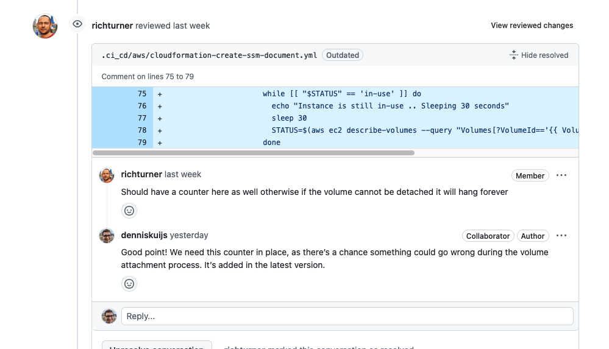

### 3.2. Stop Docker before unmounting/detaching the volume
The second change I made was to add an extra command in the `create-ssm` `CloudFormation` template to stop `Docker` before unmounting and detaching the volume. Previously, if the volume was unmounted and detached without stopping Docker, OpenRemote would lose access to the data, causing the containers become unhealthy. By stopping `Docker` first, OpenRemote is taken offline safely and can be restarted once the volume is reattached.

```
- name: StopDocker
  action: aws:runShellScript
  inputs:
    runCommand:
      - systemctl stop docker.socket docker.service
```

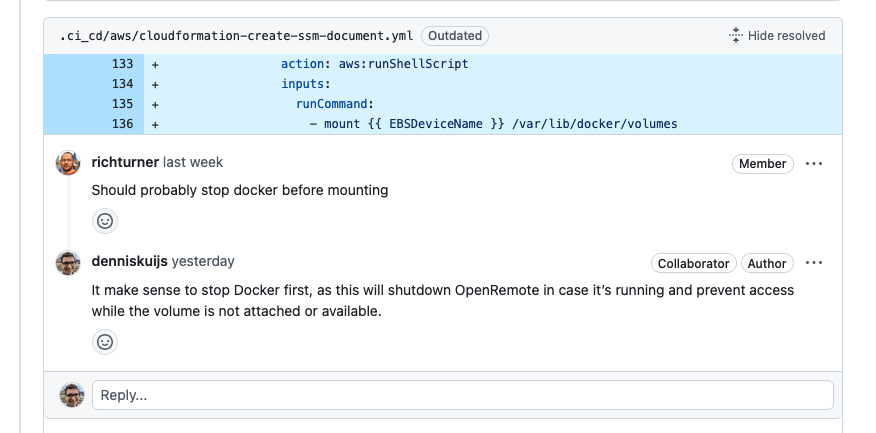

### 3.3. Wait until EC2 instance is created before attaching/mounting the volume

In my initial attempt, I added logic to provision the `EBS` data volume using a seperate `CloudFormation` template. Once the instance was created by the `create-ec2` stack, I attached the volume immediately. The goal with this approach was to ensure the volume would be mounted in time before the `cfn-scripts` responsible for formatting and mounting the volume were executed.

However, the creation of the `EC2` instance is only considered complete once all `cfn-scripts` have been successfully executed and `cfn-signal` returns a `SUCCESS` status. Since volume creation and mounting were part of the `cfn-scripts`, It wasn't possible to wait for the instance to be initalized beforehand. As a result, if the volume couldn't be attached or mounted successfully or in time, the `cfn-scripts` would fail, and the `CloudFormation` stack will be rolled back.

To address this issue, I moved the provisioning of the `EBS` data volume into the `create-ec2` stack. Since the volume must reside in the same availibilty zone as the instance, it is now created immediately after the instance is successfully launched.

```
EBSDataVolume:
  Type: AWS::EC2::Volume
  Properties:
    AvailabilityZone: !GetAtt EC2Instance.AvailabilityZone
    Size: !Ref DataDiskSize
    VolumeType: gp3
    SnapshotId: !If [SnapshotProvided, !Ref SnapshotId, !Ref 'AWS::NoValue']
    Tags:
      - Key: Name
        Value: !Sub ${Host}/data
```

After the instance is successfully created, I added logic in the `provision host` script to execute the `SSM` document responsible for attaching and mounting the `EBS` data volume.
As part of this change, the previous logic for handling volume attachment and mounting was removed from the `cfn-scripts` section within the `create-ec2` `CloudFormation` template.

```
PARAMS="InstanceId=$INSTANCE_ID,VolumeId=$VOLUME_ID,DeviceName=$EBS_DEVICE_NAME"

COMMAND_ID=$(aws ssm send-command --document-name attach_volume --instance-ids $INSTANCE_ID --parameters $PARAMS --query "Command.CommandId" --output text $ACCOUNT_PROFILE 2>/dev/null)

if [ $? -ne 0 ]; then
  echo "Volume attaching/mounting failed"
  exit 1
fi

STATUS=$(aws ssm get-command-invocation --command-id $COMMAND_ID --instance-id $INSTANCE_ID --query "StatusDetails" --output text $ACCOUNT_PROFILE 2>/dev/null)

while [[ "$STATUS" == 'InProgress' ]]; do
    echo "Volume attaching/mounting is still in progress .. Sleeping 30 seconds"
    sleep 30
    STATUS=$(aws ssm get-command-invocation --command-id $COMMAND_ID --instance-id $INSTANCE_ID --query "StatusDetails" --output text $ACCOUNT_PROFILE 2>/dev/null)
done

if [ "$STATUS" != 'Success' ]; then
  echo "Volume attaching/mounting has failed status is '$STATUS'"
  exit 1
else
  echo "Volume attaching/mounting is complete"
fi
```

With this approach, volume attachment and mounting only occur after the instance has been successfully created. This ensures the volume operations are only execusted on a fully initialized instance, reducing the risks of errors during provisioning when for example the volume is not attached to the instance on time before executing the `cfn-scripts`.


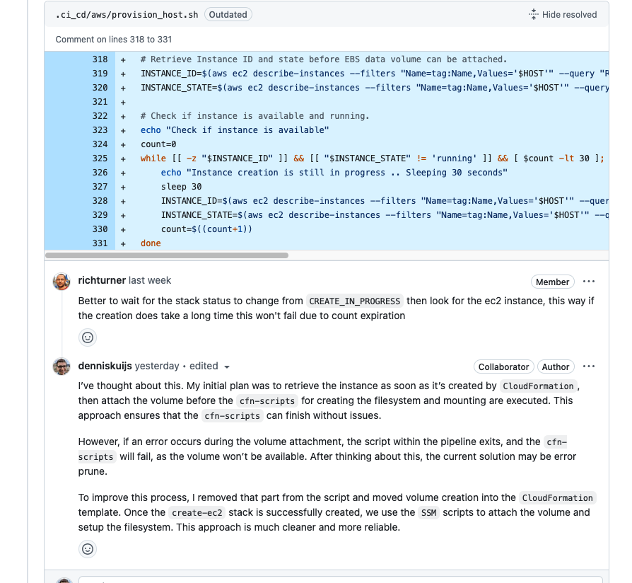

### 3.4. SSM Documents for each account instead of host

When provisioing the `SSM` documents. In my first attempt, they will be created for each individual host. Since the documents are configureable with parameters and we need to specify on which instance they need to be executed. There is no reason to create this for every single host. Instead, provisioning them for each account is a beter alternative. To achieve this, I moved this logic to the `provision account` script.

```
# Provision SSM Documents
if [ -f "${awsDir}cloudformation-create-ssm-documents.yml" ]; then
  TEMPLATE_PATH="${awsDir}cloudformation-create-ssm-documents.yml"
elif [ -f ".ci_cd/aws/cloudformation-create-ssm-documents.yml" ]; then
  TEMPLATE_PATH=".ci_cd/aws/cloudformation-create-ssm-documents.yml"
elif [ -f "openremote/.ci_cd/aws/cloudformation-create-ssm-documents.yml" ]; then
  TEMPLATE_PATH="openremote/.ci_cd/aws/cloudformation-create-ssm-documents.yml"
else
  echo "Cannot determine location of cloudformation-create-ssm-documents.yml"
  exit 1
fi

STACK_NAME=or-ebs-volume-ssm-documents

# Create SSM Documents for attaching/detaching EBS data volume in specified account
STACK_ID=$(aws cloudformation create-stack --capabilities CAPABILITY_NAMED_IAM --stack-name $STACK_NAME --template-body file://$TEMPLATE_PATH --output text $ACCOUNT_PROFILE)

# Wait for CloudFormation stack status to be CREATE_*
echo "Waiting for stack to be created"
STATUS=$(aws cloudformation describe-stacks --stack-name $STACK_NAME --query "Stacks[0].StackStatus" --output text $ACCOUNT_PROFILE 2>/dev/null)

while [[ "$STATUS" == 'CREATE_IN_PROGRESS' ]]; do
    echo "Stack creation is still in progress .. Sleeping 30 seconds"
    sleep 30
    STATUS=$(aws cloudformation describe-stacks --stack-name $STACK_NAME --query "Stacks[0].StackStatus" --output text $ACCOUNT_PROFILE 2>/dev/null)
done

if [ "$STATUS" != 'CREATE_COMPLETE' ] && [ "$STATUS" != 'UPDATE_COMPLETE' ]; then
  echo "Stack creation has failed status is '$STATUS'" >&2
  exit 1
else
  echo "Stack creation is complete"
fi
```

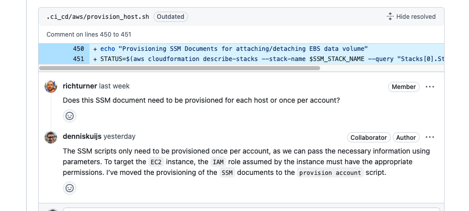

### 3.5. Improve check if filesystem exists

In my initial implementation, I used the `Snapshot` variable to determine whether the script should create a filesystem on the `EBS` data volume or simply mount it. When a snapshot is used, the volume already contains a filesystem, so it only needs to be mounted.
Creating a new filesystem in this case would overwrite the existing one, resulting in data loss. Therefore, it's important to ensure that a filesystem is only created when no snapshot is provided.

After improving the implementation, I now use the `blkid` command to check for an existing filesystem. This command also retrieves the volume's `UUID` for generating the `/etc/fstab` entry.

Since the `SSM` commands are executed asynchronously, the system doesn't wait for previous commands to complete before continuing. However, retrieving the filesystem information is only possible once the volume is properly attached. To handle this, I added a while loop that waits for a filesystem to be detected before proceeding with the script. 

```
count=0
while [[ -z "$FILESYSTEM" ]] && [ $count -lt 30 ]; do
  echo "Filesystem is currently not available .. Sleeping 30 seconds"
  sleep 30
  FILESYSTEM=$(blkid -o value -s TYPE {{ DeviceName }})
  count=$((count+1))
done

if [ -z "$FILESYSTEM" ]; then
  mkfs -t xfs {{ DeviceName }}
  mount {{ DeviceName }} /var/lib/docker/volumes
else
  mount {{ DeviceName }} /var/lib/docker/volumes
fi
```

Currently, the implementation is not optimal. When creating the volume for the first time, there is no filesystem present, which causes the script to loop up to 30 times (approxmately 900 seconds) before proceeding with creating a filesystem.
This delay is too long, so I'm planning to improve the implementation to handle this more efficently.

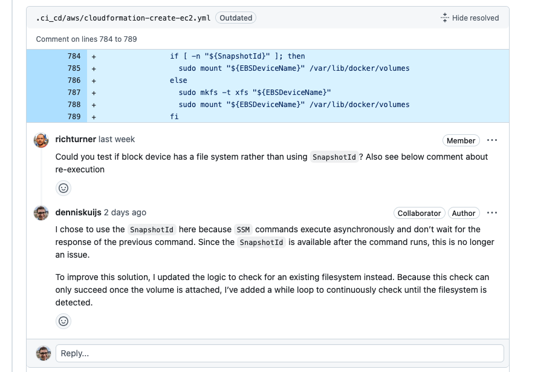

### 3.6. Problems with auto-reloader.conf

Updating the `CloudFormation` stack re-executes the `cfn-scripts`, causing duplicate entries in `/etc/fstab`

```
services:
  systemd:
    cfn-hup:
      enabled: true
      ensureRunning: true
      files:
        - /etc/cfn/cfn-hup.conf
        - /etc/cfn/hooks.d/amazon-cloudwatch-agent-auto-reloader.conf
```

In my new implementation, I moved the volume attachment and mounting logic out of the `cfn-scripts` and into the `SSM` documents. This change ensures the logic isn't re-execued every time the instance is updated.

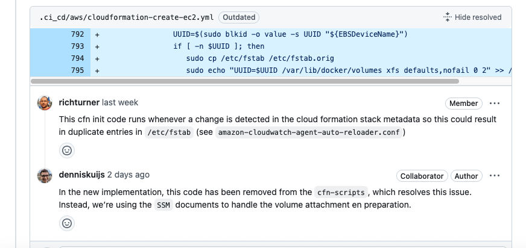

### 3.7. Attaching volume within the provision host script

Initally, I added the logic for attaching the volume in the `provision host` script. However, As previously mentioned, this approach could lead to errors if the volume wasn't created on time when the script ran.
To resolve this, I moved the provisioning of the `EBS` data volume to the `create-ec2` `CloudFormation` template and removed it from the `provision host` script. Now, once the `instance` is successfully created and the `cfn-signal` returns a `SUCCESS` status. The volume is attached and mounted using `SSM` documents.


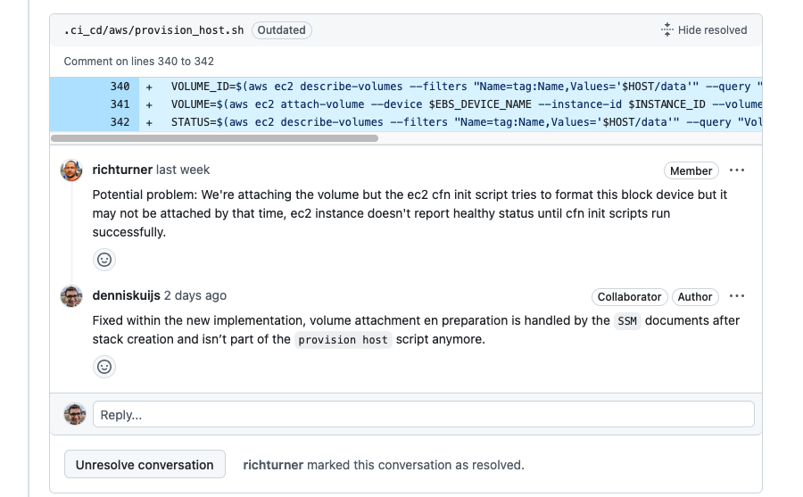

### 3.8. Move provisioning DLM Policy to create-ec2 stack

In my inital approach, I included logic in the `provision host` script to create the `DLM` policy using a separate `CloudFormation` stack. 
However, since `DLM` is a native part of `EC2`, it made more sense to move the this part into the `create-ec2` `CloudFormation` stack. This change simplifies the `provision host` script and ensures the `DLM` policy is created automatically once the `EBS` data volume is successfully provisioned.

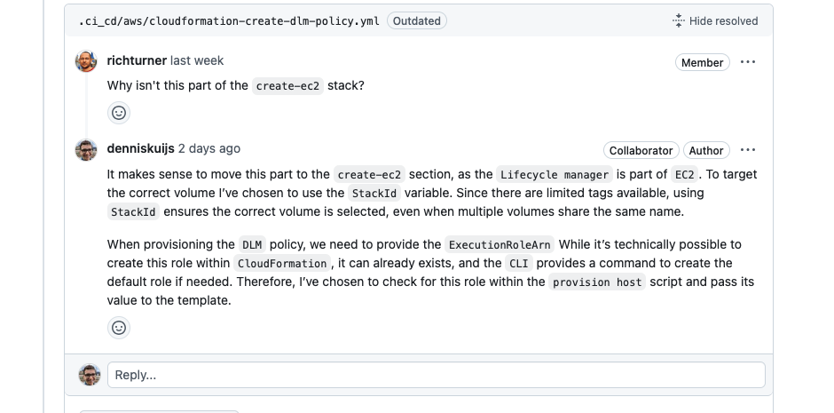

### 3.9. Move provisioning EBS data volume to create-ec2 stack

Initially, I considered splitting the provisioning process to avoid the risk of the volume being detached or modified during `CloudFormation` updates.

However, after moving the volume creation into the `create-ec2` template, I found out that only the root volume is affected during updates, while data volumes remain unchanged. To add an extra layer of safety, I’ve applied `DeletionPolicy: Snapshot`, which ensures a final snapshot is taken before the volume is deleted.

Because the volume must reside in the same `Availability zone` as the instance, it is now provisioned only after the instance is fully created and the `cfn-signal` returns a `SUCCESS` status.

I’ve also removed the steps for creating the filesystem and mounting the volume from the `cfn-script`.
That logic is now handeled via `SSM` documents, which are executed by the `provision host` script after the stack is successfully created.

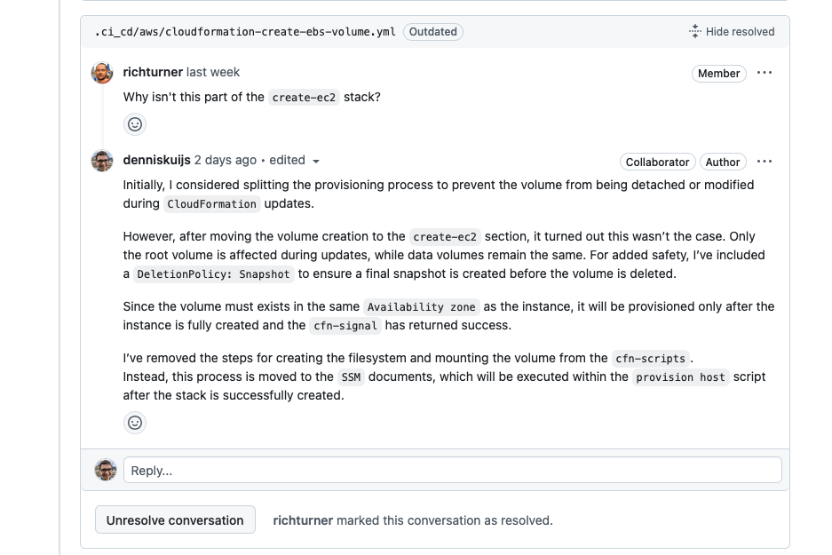