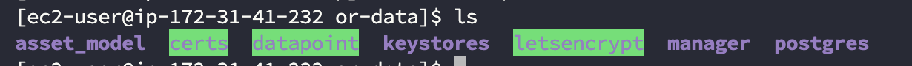

<!-- title: Research: How can we decouple the IoT data from the virtual machine and store them on a separate EBS (data) volume? -->

## Research: How can we decouple the IoT data from the virtual machine and store them on a separate EBS (data) volume? <!-- omit in toc -->

## Context
The creation of various cloud services is done using `CloudFormation` templates. [CloudFormation](https://aws.amazon.com/cloudformation/) is Amazon's Infrastructure as Code (IaaC) tool, allowing infrastructure to be set up through code. 
This approach makes it possible to easily create and modify infrastructure without having to make changes through an administrator panel.

However, the current process is not ideal and causes some issues in certain cases.

When changes are made to the `CloudFormation` templates, Amazon sometimes decides not to apply these changes to the existing infrastructure. Instead, Amazon chooses to completely remove and rebuild the infrastructure with the applied changes. This results in the loss of all data on the existing infrastructure, including data from the IoT platform.
It is difficult to predict when Amazon will take this drastic measure. Sometimes this happens only with large changes, but even smaller modifications can lead to this outcome. Due to this uncertainty, the update process is considered risky. To prevent errors and potential data loss, OpenRemote has decided to perform the process manually.

Before each update, a `snapshot` (backup) of the `virtual` machine is created. This snapshot contains both the IoT platform data and a copy of the operating system. If an issue occurs during or after the update, the `snapshot` can be quickly restored, resulting in minimal downtime for the customer. In this situation, no data is lost.

Manually updating the `virtual` machines is a time-consuming process. As the number of customers using the 'managed' service increases, more time is spent on these tasks.
Therefore, OpenRemote is looking for ways to further automate this process. This research focuses on storing the IoT data on a separate `EBS` data volume so that backups can be more targeted, reducing the risk of data loss during updates by decoupling the data from the `virtual` machine.

<div style="page-break-after: always;"></div>

## DOT-Framework
For this research, the following methods from the [DOT Framework](https://ictresearchmethods.nl/) are used:

- `Literature Study` (To investigate how Amazon EBS and the Lifecycle Policy Manager function, as well as to understand how the filesystem works within Linux and can be used for setting up external block devices)
- `Gap Analysis` (To get an overview of the current situation and the desired situation)
- `Decomposition` (To visualize and understand how the current situation is functioning)
- `Prototyping` (To explore how potential solutions perform within the context of OpenRemote)
- `System Tests` (To test the potential solutions using various test cases, ensuring that the solution functions as expected)

<div style="page-break-after: always;"></div>

## Contents <!-- omit in toc -->

<div class="toc">

- [Context](#context)
- [DOT-Framework](#dot-framework)
- [1. Situation](#1-situation)
  - [1.1. Current Situation](#11-current-situation)
  - [1.2. Desired Situation](#12-desired-situation)
- [2. Amazon Elastic Block Storage (EBS)](#2-amazon-elastic-block-storage-ebs)
  - [2.1. What is Amazon Elastic Block Storage (EBS)?](#21-what-is-amazon-elastic-block-storage-ebs)
  - [2.2. Volume Types](#22-volume-types)
  - [2.3. Pricing](#23-pricing)
  - [2.4 Volume Configuration](#24-volume-configuration)
    - [2.4.1. Prerequisites](#241-prerequisites)
    - [2.4.2. Creating a new EBS Volume](#242-creating-a-new-ebs-volume)
    - [2.4.3. Attach Volume to an EC2 Instance](#243-attach-volume-to-an-ec2-instance)
    - [2.4.4. Create Filesystem on Volume](#244-create-filesystem-on-volume)
    - [2.4.5. Mount Volume to directory](#245-mount-volume-to-directory)
    - [2.4.6. Automatically mount volume on system reboot](#246-automatically-mount-volume-on-system-reboot)
  - [2.5. EBS Snapshots](#25-ebs-snapshots)
    - [2.5.1. Manually creating snapshots](#251-manually-creating-snapshots)
    - [2.5.2. Restoring snapshots](#252-restoring-snapshots)
    - [2.5.3. Pricing](#253-pricing)
  - [2.6. Amazon Data Lifecycle Manager](#26-amazon-data-lifecycle-manager)
    - [2.6.1. Creating policies](#261-creating-policies)
- [3. Prototyping](#3-prototyping)
  - [3.1. Docker Compose](#31-docker-compose)
  - [3.2. Approach 1 (Bind Mount)](#32-approach-1-bind-mount)
  - [3.3. Approach 2 (Named volumes)](#33-approach-2-named-volumes)
  - [3.4. Approach 3 (Named volumes)](#34-approach-3-named-volumes)
  - [3.5. Approach 4 (Named volumes)](#35-approach-4-named-volumes)
  - [3.6. Tests](#36-tests)
    - [3.6.1. Setup](#361-setup)
    - [3.6.2. Test Cases](#362-test-cases)
- [4. Advise \& Summary](#4-advise--summary)
  - [4.1. Advise](#41-advise)
  - [4.2. Feedback from Team Members](#42-feedback-from-team-members)
  - [4.3. Next Steps](#43-next-steps)
- [5. Source](#5-source)

</div>

<div style="page-break-after: always;"></div>

## 1. Situation
In this section, I will discuss the current situation and the desired outcome. Additionally, it will provide an overview of the bridges that need to be built to reach the new situation.

### 1.1. Current Situation
The picture below gives an overview of the current situation. The `EC2` machine is created with an `CloudFormation` template. The machine is using the default `Amazon Linux 2023 AMI` (Amazon Machine Image) and is provisoned with 30 GB of `gp3` (General Purpose) block storage. Optionally there will be a `Elastic IP` assigned to the `EC2` instance.
The `EBS` volume is used for both the operating system and data storage and no additional volumes or partitions are being created.

During the execution of the `CloudFormation` template `cfn-init` runs several scripts after the machine is booted. These scripts setup the following services on the `EC2` instance.

- The system creates a `swapfile` if not already exists.
- The system configures the `CloudWatch` agent.
- The system creates an `cronjob` for daily cleanup (vacuum). 
- The system creates an `deployment.local` directory.
- The system creates an `S3` bucket for storing backups if not already exists and synchronises the contents to the bucket. There will be an `systemd` process created for executing the backup task as well as an `cronjob` for executing it every day on 5AM.
- The system sets the permissions and starts the backup services.
- The system creates an `DNS` `A-record` update script if no `Hosted Zone Name` is provided and creates an `systemd` process for it.
- The system sets the permissions and starts the DNS update service.
- The system executes an `Python` script that genereates `SMTP` credentials for Amazon `SES`.
- The system configures the `.env` variables for Amazon `SES`, `EFS`, `Route53` and `CloudWatch` depending on the `.env` variable
- The systems installs `Docker` and `Docker Compose` and creates and `systemd` process for it.
- The system installs `Cronie` and creates and `systemd` process for it.
- The system restarts the `CloudWatch` agent.
- The system configures the `cfn-hup` helper that detects changes in the resource metadata and creates and `systemd` process for it.

The system also configures `CloudWatch` and creates some alarms for several metrics. When an alarm is triggered, an e-mail will be sent to OpenRemote. This is configured via the `SNS` subscription/topic.


There are several things happening simultaneously in this scenario. The `EC2` instance is using a single root block device, which means there is no separation between the system data and application data. The volume has been configured with the property `DeleteOnTermination=true`, meaning it will be deleted when the instance is terminated. However, simply changing this setting is not enough to access the IoT data easily. This is because the volume is also serving as the boot drive for the operating system.
When changes are made to the `CloudFormation` template, there is a possibility that the `EC2` instance will be recreated to apply the updates. This could result in the termination of both the instance and its associated volume, along with the data stored on it.

### 1.2. Desired Situation
To solve this issue, I suggest decoupling the IoT data from the root volume and storing it on a separate `EBS` data volume. This approach simplifies data backup since it is no longer tied to the boot device and can be attached to other `EC2` (OpenRemote) instances. These instances can seamlessly access the same data and connections.

Additionally, by detaching the data from the root volume, there is no risk of data loss during `CloudFormation` updates. This opens up new possibilities, such as creating test instances with specific data or enabling `blue/green deployments`. With this setup, a new instance can be launched with the necessary data while the existing instances are being updated.


<div style="page-break-after: always;"></div>

## 2. Amazon Elastic Block Storage (EBS)
In this section, I will discuss both the opportunities and challenges I have encountered during my research on Amazon Elastic Block Storage (`EBS`).

### 2.1. What is Amazon Elastic Block Storage (EBS)?
Amazon Block Storage provides scalable, high-performance block storage that integrates seamlessly with Amazon Elastic Compute Cloud (EC2). You can create volumes that attach to `EC2` instances, enabling you to store files and install applications just like on a traditional hard drive. Additionally, you can create snapshots, which are point-in-time backups of your volumes. These snapshots allow for quick data recovery and you can easily create new volumes from a snapshot.

Amazon `EBS` offers the following features:

- `Volume types`: Choose from a variety of volume types, including standard `HDD`, `SSD`, and `I/O-optimized` SSD drives. These volumes can be upgraded or downgraded without any downtime, providing excellent scalability.
- `Snapshots`: You can create snapshots of existing volumes and use them to create new volumes. These snapshots can be shared with other AWS accounts or moved to different availability zones.
- `Encryption`: Volumes can be encrypted using Amazon's AES-256 encryption standard. The encryption is handled on the server, ensuring that both volumes and snapshots are encrypted at rest and during data transit. You can use Amazon's default KMS encryption key or create your own for more access control.
- `Archiving`: Snapshots can be archived for a minimum of 90 days at a low cost, making it ideal for storing backups that are rarely accessed or for meeting compliance requirements.

### 2.2. Volume Types
There are several volume types to choose from. Since OpenRemote exclusively uses SSD drives, HDD drives will not be included in this list.

- `General Purpose gp2/3`: The SSD volume is ideal for a wide range of workloads, including virtual desktops and boot volumes. The minimum volume size is 1 GB, and it can be expanded up to 16 TB. However, this drive does not support multi-attach, meaning it can only be attached to one `EC2` instance at the same time.
- `iO Block Express io1/io2`: The SSD volume is optimized for higher IOPS, with a minimum size of 4 GB and the ability to scale up to 64 TB. In addition to its high performance, the drive supports multi-attach, allowing it to be attached to multiple `EC2` instances simultaneously. <br/>

This feature can be particularly useful in OpenRemote's use case for creating test instances or updating a specific instance without downtime.

Currently, OpenRemote is using `gp3` drives for their `EC2` instances, which handle the workload without any issues. As a result, there is no need to upgrade them, except in one specific use case. Since `io` drives support multi-attach, they can be attached to multiple instances simultaneously, opening up new possibilities like `blue/green deployments`. When OpenRemote decides to integrate this option, a migration will be required.

### 2.3. Pricing
Pricing varies based on the region where the resources are deployed. Since OpenRemote uses `eu-west-1` as their primary region, the prices listed below will apply on this. 

- `General Purpose gp3`: $0,088/GB per month 
- `General Purpose gp2`: $0,11/GB per month 
- `iO Block Express io2`: $0,138/GB per month
- `iO Block Express io1`: $0,138/GB per month with an additional charge of $0.072 per provisioned IOPS per month

The prices above only reflect storage costs. Additional charges apply for the amount of IOPS and throughput provisioned. Since OpenRemote is not modifying these values and the default values are free of charge, they are not included in the list.

Based on the values that are provided in the `CloudFormation` template, OpenRemote is currently using `30 GB` of `gp3` storage.
The calculation below gives an estimated of their montly storage costs for a single `EC2` instance using `30 GB` of  `gp3` storage .

$0,088/GB * 30 GB =  $2.64 per month.

When switching to the `io2` volume, the costs would be as follows:
$0,138/GB * 30 GB = $4.14 per month.

When switching to the `io1` volume, the costs would be as follows:
$0,138/GB * 30 GB = $4.14 per month.

As you can see, the prices for both `io1` and `io2` are the same, despite the additional `IOPS` charge. This is because there is a free baseline of 3000 IOPS, and OpenRemote is not changing these values.

The price difference between `io` drives and `gp` drives is minimal. When creating an additional volume for storing (IoT) data, the root device can easily be scaled down to reduce costs, as it doesn't require much space. In this case, the costs would be approximately the same.
To further reduce costs, OpenRemote can consider auto-scaling the volumes based on the actual amount of storage needed. Since `EBS` pricing is based on the amount of GB provisioned, not the amount used, this approach can help lower the bill even further.

<div style="page-break-after: always;"></div>

### 2.4 Volume Configuration

#### 2.4.1. Prerequisites
 - You have an active `AWS` account with the necessary permissions to create a new volume.
 - You have an existing Elastic Compute (`EC2`) instance, to attach the new volume.

#### 2.4.2. Creating a new EBS Volume
There are several methods to create a new Elastic Block Storage (`EBS`) volume, including using the `AWS CLI`, `AWS CloudFormation`, or the Management Console.


Creating a new volume through the Management Console is simple and straightforward. 
You can configure the following options:

`Volume type` <br/>
Select the type of volume you want to use. The available options are listed [here](#22-volume-types) 

`Size (GB)` <br/>
The storage capacity in gigabytes available on the drive. The default value is 100 GB, but you can configure EBS volumes ranging from 1 GB to 16,384 GB. <br/>
`EBS` costs are based on the amount of storage you provision, not on how much you actually use. For example, if you provision a 30 GB `EBS` volume but only use 5 GB, you'll still being charged for the entire 30 GB.

`IOPS` <br/>
The number of operations per second (IOPS) the volume can support. By default, this value is set to 3,000, which is also the minimum. <br/>
You can adjust this up to 16,000 IOPS for gp3 volumes and up to 64,000 or 256,000 IOPS for io1/io2 volumes, depending on the volume size.

`Throughput` <br/>
The throughput performance the volume can handle. The default value is set to 125 MB/s, but you can increase it up to 1,000 MB/s based on the amount of `IOPS` you provision. The throughput rate is 0.25 MB/s for each additional `IOPS`.

`Availability Zone` <br/>
The Availability Zone where the volume is being created. The number of available AZs depends on the region where you're creating the volume. To ensure data durability and prevent failures, volumes are replicated within their respective Availability Zone. <br/>
To attach an `EBS` volume to an `EC2` instance, the instance must be located in the same Availability Zone as the volume.

`Snapshot ID` <br/>
If you want to create a volume from an existing snapshot, you can select the `Snapshot ID` during volume creation. The data from the snapshot will be available immediately.

`Encryption` <br/>
You have the option to encrypt the volume. Amazon `EBS` encryption uses the Advanced Encryption Standard (AES-256) algorithm along with Amazon's Key Management Service (KMS). <br/>
You can either use the default encryption key or create your own. Using your own key provides greater flexibility, including the ability to create, rotate, disable, and define access controls and security audits.

It is also possible to create `EBS` volumes while launching an `EC2` instance. These volumes are automatically attached to the instance.

<div style="page-break-after: always;"></div>

#### 2.4.3. Attach Volume to an EC2 Instance


After creating an `EBS` volume, you can attach it to an `EC2` instance. <br/>
Data volumes can be attached to either running or stopped instances, while root volumes can only be attached or detached when the instance is fully stopped. <br/>
You can only attach volumes that are in the available state. You can check the status on the details page for each individual volume.


To attach a volume to an instance, you need to configure the following options:

`Instance type` <br/>
Choose the instance to which you want to attach the volume.
Only instances located in the same availability zone as the `EBS` volume will be displayed.

`Device name` <br/>
Select a device name for the `EBS` volume. <br/>
Data volumes typically use names like /dev/sd[a-z], with names between /dev/sd[f-p] being recommended. Root volumes generally use the default /dev/xvda name. Each device name can only be used once.

<div style="page-break-after: always;"></div>

#### 2.4.4. Create Filesystem on Volume

Before an `EBS` volume can be used, it must be formatted and have a filesystem on it. <br/>
Start by running the command below to list all existing block devices on the host machine.

```sh
sudo lsblk -f
```

As shown in the image below, the device is recognized, but it does not yet have a filesystem or a mountpoint.


To create a filesystem, use the command below.

```sh
sudo mkfs -t xfs /dev/sdb
```

This command creates an `XFS` filesystem on the device named `/dev/sdb`. <br/>
You cannot use the name visible in the `lsblk` output. Instead, you need to use the device name assigned during the `EBS` volume creation. The device names can be found under the storage tab on the details page of the specific `EC2` instance.


`XFS` is one of the filesystems you can use, but you can also choose others like `ext3`, `ext4`, and more. Since the root device is also using the `XFS` filesystem, it's recommended to stick with the same for consistency. <br/>
After creating the filesystem, run the `lsblk` command again to verify if the filesystem appears in the list.


As shown in the picture above, the filesystem has been created successfully, and the device now has an assigned `UUID`. <br/>
It is recommended to copy the device's `UUID` and store it in a safe place, as you will need it in a later step.

<div style="page-break-after: always;"></div>

#### 2.4.5. Mount Volume to directory
Once you have successfully formatted the volume and created a filesystem, you can mount the volume to a directory using the following command:

```sh
sudo mount /dev/sdb /or-data
```

You need to specify the device name assigned during `EBS` volume creation. You can mount the volume to any directory of your choice. <br/>
The directory must already exist at the root of the host before you can mount the volume. The command will not create the specified directory for you. If the directory does not exist, the command will throw an error.

After mounting the volume, you can check the status with the `lsblk` command. If the device is successfully mounted, you should see the directory in the list, along with the remaining capacity and the amount of storage used.


#### 2.4.6. Automatically mount volume on system reboot
To make sure that the volume is mounted after a system reboot. You need to add a line in the `/etc/fstab/` file. This is the `System File Table` and stores information about the drives. <br/>
Making changes in this file is dangerous and can cause boot errors if the file is corrupted or incorrect. Please make a back-up before editing this file.

To create a backup from this file you can enter the following command.

```sh
sudo cp /etc/fstab /etc/fstab.orig
```

This command copies the file from the `/etc/fstab` location and places it in the same folder with a different extension.
Once the backup is successfully created, you can add the new volume to the file table. There are two convenient ways to achieve this:

- By using a text editor such as `VIM` or `GNU Nano`.
- By using the command line to directly insert the appropriate row.

The entry has a few parameters that needs to exists:

`UUID` <br/>
The first parameter is the device `UUID`, which is visible when executing the `lsblk` command. You can also retrieve the `UUID` using the following command.

```sh
sudo blkid
```

`Directory` <br/>
The second parameter is the directory where the volume needs to be mounted. This directory must already exist, as the system cannot create directories automatically.

`Filesystem Type` <br/>
The third parameter is the filesystem type. In most cases, this is `XFS`, but the value depends on the filesystem you selected during the initial volume setup.

`Flags` <br/>
The fourth parameter consists of device `flags`. While there are many different `flags`, the most commonly used is the `defaults` flag. This includes several options, such as:

- `rw`: Allows reading and writing
- `suid`: Enables special security bits
- `dev`: Enables block-special devices
- `exec`: Permits execution of binaries
- `auto`: Enables automatic mounting
- `nouser`: Restricts mounting to the root user only
- `async`: Allows asynchronous I/O

The `nofail` flag is also often used to ensure that the system does not fail on boot if a specified device or mountpoint is unavailable.

`Dump` <br/>
The fifth parameter determines whether the filesystem should be backed up using the `dump` command. The value can be either `1` (yes) or `0` (no).

`Device type` <br/>
The last parameter determines whether the device is a `root` or `non-root` device. The value can be either `1` (for root) or `2` (for non-root).

When you succesfully created the entry in the `/etc/fstab` file, it should look like this


If this entry is not created, the system will not only skip mounting the volume on reboot, but it can also result in mount errors when the volume is attached to another `EC2` instance. <br/>
This happens because device names can change depending on the machine, but the `UUID` remains consistent throughout the volume's lifespan. <br/><br/>
If the system detects that you are attempting to mount the volume that was previously mounted to a different device name, the following error will be thrown:


You can ignore the error and mount the volume anyway with the following command:

```sh
sudo mount -o nouuid /dev/sdb /or-data
```

Creating the `fstab` entry ensures that the device is mounted using its `UUID`, preventing errors when it is connected to another `EC2` instance, even if the device name differs.

<div style="page-break-after: always;"></div>

### 2.5. EBS Snapshots
This section explains how snapshots (backups) can be created/restored with the built-in snapshot functionality.

#### 2.5.1. Manually creating snapshots

You can create snapshots on specific `EBS` volumes and on instance level.
To create a snapshot via the management console, You need to configure the following options:

<br/>

- `Source`: You can choose between `Volumes` and `Instances` when creating a snapshot. When creating a snapshot from an instance, you still have the option to exclude the root device or specific data volumes.
- `Volume/Instance ID`: Depending on the source, you will need to select either the `Volume` or `Instance ID` for which you want to create the snapshot.
- `Description`: You have the option to provide a description for the snapshot to make it easier to recognize.

When the snapshot is being created, It will show the `Pending` status on the overview page. Creating snapshots can take between 5 min and several hours depending on the volume size.


After the snaphot is successfully created you will see the `Complete` status on the overview page.


<div style="page-break-after: always;"></div>

#### 2.5.2. Restoring snapshots

To restore a snapshot, you can choose to either create a new volume or an `AMI (Amazon Machine Image)`, which can then be used to launch a new instance.

<br/>

You can configure the volume in the same way as you would when creating a new volume, but by specifying a `Snapshot ID`. <br/>
Once the volume is created, you can attach and mount it to an `EC2` instance. The data from the snapshot will be immediately available.

<br/>

#### 2.5.3. Pricing
Pricing varies based on the region where the resources are deployed. Since OpenRemote uses `eu-west-1` as their primary region, the prices listed below will apply on this. 
`EBS` Snapshot pricing is very simple and only has a few different options:

- `Standard Pricing`: $0,05/GB per month 
- `Archive Pricing`: $0,0125/GB per month 

The pricing above reflects storage costs. There are no charges for restoring snapshots. However, restoring data from archive will incur a cost of $0.03 per GB of data retrieved.

If snapshots are created with the `Fast Snapshot Restore` option enabled, you are charged in `Data Service Units (DSU)` with a minimum charge of one hour. These charges continue as long as the option remains enabled for the snapshot, which can increase your bill quickly. Therefore, it's recommended to enable this feature only when absolutely necessary.

The DSU pricing for `eu-west-1` is $0.83 per 1 DSU hour for each snapshot with this feature enabled in a specific availability zone.

When creating a volume from a snapshot with `Fast Snapshot Restore` enabled, it will immediately deliver all its provisioned performance `(IOPS)`, eliminating the latency usually associated with I/O operations when accessing the volume for the first time. This ensures that the volume is fully initialized upon creation.

<div style="page-break-after: always;"></div>

### 2.6. Amazon Data Lifecycle Manager

To automate snapshot creation, retention, and deletion, you can use `Amazon Data Lifecycle Manager`. With this tool, you can configure policies that define when snapshots are created and from which resources. You can also specify how frequently the policy should be executed. Additionally, it allows you to run scripts before or after snapshot creation, automatically copy snapshots to other regions or accounts, and even set rules for snapshot retention and archiving.

#### 2.6.1. Creating policies

To create a policy you can either choose between two different options:

- `Default Policy`: The default policy is simple and can only be used to create snapshots from volumes. Customization options are limited. it’s not possible to target specific volumes or instances. Retention settings can only be configured with a maximum of 14 days, and snapshot creation can be scheduled between 1 and 7 days. <br/> Additional features such as fast snapshot restore, archiving, and sharing are not available when using this policy. <br/> <br/>
- `Custom Policy`: With a custom policy, there are no limits. You can target volumes and instances based on tags. It allows up to 4 different schedules, which can run at any time using a cron expression. Advanced features such as archiving, deletion, sharing, and running scripts are also available with this option.

<br/>

In this example, I have created a `Custom Policy` because it offers more flexibility and is better suited to the needs of OpenRemote.
To create an `Custom Policy` within the management console, you need to configure the following options:

- `Target resource types`: You can either choose between volumes or instances. You can then specify which resource you want to select based on different tags such as name and id.
- `Description`: You can enter a description to easy identify the policy.
- `IAM Role`: To create snapshots, Lifecycle manager must have the approriate permissions. You can either select an existing `IAM` role or use the default one. If Lifecycle manager has insufficient permissions, the snapshot process will throw an error.
- `Policy status`: You can specify if you want to enable this policy after creation. By doing so, Lifecycle manager wil start the creation of snapshots inmmediately according to the configured schedule.
- `Exclude devices`: If you have selected the instance as an resource type, you have additionaly the option to exclude the root volume or specfic data volumes that are attached to the `EC2` instance.

<br/>

After that, you can create a schedule to specify how often the snapshots should be created. With a `Custom Policy`, you can configure up to 4 different schedules. At this stage, you can also set the retention period, determining how long the snapshots will persist. This can be specified either as a number of days or based on the number of recurring snapshots.

Optionally, You can configure a few advanced settings such as:

- `Tags`: You can specify tags that need to apply on a specifc snapshot, or you can simply copy the tags from the resource.
- `Snapshot archiving`: You can specify if the snapshot needs to be archived, this setting is only available when the schedule creates an snapshot at least every 28 days.
- `Fast Snapshot Restore`: You can specify if fast snapshot restore needs to be enabled for the snapshots that are being created by this policy. Fast Snapshot restore is expensive, so only enable this feature when it's really necessary
- `Cross Region Copy`: You can specify if the snapshot needs to be copied to other regions. You can copy snapshots up to three different regions.
- `Cross Account Copy`: You can specify the `AWS Account IDS` with who you want to share the snapshots created with this policy.
- `Pre/post scripts`: If you have selected Instance as an resource type, you can specify which scripts need to be executed on the `EC2` machine before and after snapshot creation.

Once you have successfully created the policy, it will appear in the list. Based on the policy status, it will immediately begin executing according to the schedule you provided. 

<br/>

<div style="page-break-after: always;"></div>

## 3. Prototyping
In this section I will explain how I configured the OpenRemote software to use the seperate `EBS` volume for storing the IoT data.

### 3.1. Docker Compose
OpenRemote uses a `Docker Compose` file to define the `containers` and their settings that need to be started within `Docker`. <br/>
The default file looks like this:

``````
# OpenRemote v3
#
# Profile that runs the stack by default on https://localhost using a self-signed SSL certificate,
# but optionally on https://$OR_HOSTNAME with an auto generated SSL certificate from Letsencrypt.
#
# It is configured to use the AWS logging driver.
#
volumes:
  proxy-data:
  manager-data:
  postgresql-data:

services:

  proxy:
    image: openremote/proxy:${PROXY_VERSION:-latest}
    restart: always
    depends_on:
      manager:
        condition: service_healthy
    ports:
      - "80:80" # Needed for SSL generation using letsencrypt
      - "${OR_SSL_PORT:-443}:443"
      - "8883:8883"
      - "127.0.0.1:8404:8404" # Localhost metrics access
    volumes:
      - proxy-data:/deployment
    environment:
      LE_EMAIL: ${OR_EMAIL_ADMIN:-}
      DOMAINNAME: ${OR_HOSTNAME:-localhost}
      DOMAINNAMES: ${OR_ADDITIONAL_HOSTNAMES:-}
      # USE A CUSTOM PROXY CONFIG - COPY FROM https://raw.githubusercontent.com/openremote/proxy/main/haproxy.cfg
      #HAPROXY_CONFIG: '/data/proxy/haproxy.cfg'

  postgresql:
    restart: always
    image: openremote/postgresql:${POSTGRESQL_VERSION:-latest}
    shm_size: 128mb
    volumes:
      - postgresql-data:/var/lib/postgresql/data
      - manager-data:/storage

  keycloak:
    restart: always
    image: openremote/keycloak:${KEYCLOAK_VERSION:-latest}
    depends_on:
      postgresql:
        condition: service_healthy
    volumes:
      - ./deployment:/deployment
    environment:
      KEYCLOAK_ADMIN_PASSWORD: ${OR_ADMIN_PASSWORD:-secret}
      KC_HOSTNAME: ${OR_HOSTNAME:-localhost}
      KC_HOSTNAME_PORT: ${OR_SSL_PORT:--1}


  manager:
#    privileged: true
    restart: always
    image: openremote/manager:${MANAGER_VERSION:-latest}
    depends_on:
      keycloak:
        condition: service_healthy
    ports:
      - "127.0.0.1:8405:8405" # Localhost metrics access
    environment:
      OR_SETUP_TYPE:
      OR_ADMIN_PASSWORD:
      OR_SETUP_RUN_ON_RESTART:
      OR_EMAIL_HOST:
      OR_EMAIL_USER:
      OR_EMAIL_PASSWORD:
      OR_EMAIL_X_HEADERS:
      OR_EMAIL_FROM:
      OR_EMAIL_ADMIN:
      OR_METRICS_ENABLED: ${OR_METRICS_ENABLED:-true}
      OR_HOSTNAME: ${OR_HOSTNAME:-localhost}
      OR_ADDITIONAL_HOSTNAMES:
      OR_SSL_PORT: ${OR_SSL_PORT:--1}
      OR_DEV_MODE: ${OR_DEV_MODE:-false}

      # The following variables will configure the demo
      OR_FORECAST_SOLAR_API_KEY:
      OR_OPEN_WEATHER_API_APP_ID:
      OR_SETUP_IMPORT_DEMO_AGENT_KNX:
      OR_SETUP_IMPORT_DEMO_AGENT_VELBUS:
    volumes:
      - manager-data:/storage
``````

As below above, several volumes are declared at the top of the `Docker Compose` file. These are `named` volumes, which are used to store data from the containers.

````  
volumes:
  proxy-data:
  manager-data:
  postgresql-data:

```` 

In the `volumes` block within a specifc container you can map a directory to either a named `volume` (that's declared at the top) or an other directory `(bind mount)`.

````  
volumes:
 - postgresql-data:/var/lib/postgresql/data
 - manager-data:/storage
```` 

In the example above, the directory `/var/lib/postgresql/data` is mounted to the `named` volume `postgresql-data`. These named volumes are automatically created by `Docker` during the execution of the `Docker Compose` file. 

If no additional options are configured, the `volumes` will be stored in the default `Docker` location at `/var/lib/docker/volumes/`.
This location is stored on the default (root) `EBS` volume. To decouple the data, the location where these files are saved needs to be changed.

In my approach, I aim to make the solution as modular as possible, ensuring that it is easy for others to modify these values for their own OpenRemote configuration.

<div style="page-break-after: always;"></div>

### 3.2. Approach 1 (Bind Mount)

In my first approach, I tried to replace the `named` volumes with the directory that is mounted on the seperate `EBS` volume. This way, the data will be stored directly on the (seperate) block device.

```sh
    volumes:
      - /or-data:/deployment
```

Unfortunately, this approach wasn't successful as I encountered various issues related to permissions. The `PostgresSQL` `container` couldn't start because it has insuficcient permissions. 

<br/>

After investigating the issue I tried to give the `postgres` user the required permissions with the following command

```sh
sudo chown -R 999:999 /or-data
```

The `uid` and `gid` with the number 999 refer to the `postgres` user, granting it access to the `/or-data` directory, which is mounted to the new `EBS` volume.
Unfortunately, this didn't solve the problem. I encountered some inconsistencies when using this command in combination with the command below.

```sh
sudo chmod -R 777 /or-data
```

This command grants full permissions (`777`) to the `/or-data` directory for read/write operations. While combining these commands sometimes resolves the issue, the problem reoccurs after rebooting the machine or the containers. <br/>
I continued my investigation and found an interesting note in the `PostgreSQL` documentation on `DockerHub`

<br/>

They describe the exact problem I encountered and resolve it by overriding the default `Postgres` data location, using the `PGDATA` `environment` variable within the `container`.

<br/>

After saving the `Docker Compose` file and rebuilding the containers, all the `containers` started without any issues, and OpenRemote is now accessible via the `Public IP`.

<br/>

Unfortunately, after detaching the `volume` and connecting it to a separate instance, the same permissions error occurred, even with the `PGDATA` variable added to the `Docker Compose` file. <br/>
Despite resetting the permissions multiple times, the issue remained unresolved.

<br/>

I continued my investigation and attempted to add `subdirectories` for each `container` in the `Docker Compose` file, as shown below:

```sh
    volumes:
      - /or-data/proxy:-/deployment
```

This setup ensures that each `container` is restricted to writing only to its designated subdirectory, preventing multiple containers from writing to the same directory, such as `/or-data`, simultaneously. 
I tested this small change, and it resolves the permissions error. To make this approach more modular, I’ve added some `environment` variables.

```
# OpenRemote v3
#
# Profile that runs the stack by default on https://localhost using a self-signed SSL certificate,
# but optionally on https://$OR_HOSTNAME with an auto generated SSL certificate from Letsencrypt.
#
# It is configured to use the AWS logging driver.
#
volumes:
  proxy-data:
  manager-data:
  postgresql-data:
 
services:
  proxy:
    image: openremote/proxy:${PROXY_VERSION:-latest}
    restart: always
    depends_on:
      manager:
        condition: service_healthy
    ports:
      - 80:80 # Needed for SSL generation using letsencrypt
      - ${OR_SSL_PORT:-443}:443
      - 8883:8883
      - 127.0.0.1:8404:8404 # Localhost metrics access
    volumes:
      - ${OR_PROXY_PATH:-proxy-data}:/deployment
    environment:
      LE_EMAIL: ${OR_EMAIL_ADMIN:-}
      DOMAINNAME: ${OR_HOSTNAME:-localhost}
      DOMAINNAMES: ${OR_ADDITIONAL_HOSTNAMES:-}
      # HAPROXY_DATA_PATH: ${HAPROXY_DATA_PATH:-proxy-data}
      # USE A CUSTOM PROXY CONFIG - COPY FROM https://raw.githubusercontent.com/openremote/proxy/main/haproxy.cfg
      # HAPROXY_CONFIG: '/data/proxy/haproxy.cfg'

  postgresql:
    restart: always
    image: openremote/postgresql:${POSTGRESQL_VERSION:-latest}
    shm_size: 128mb
    volumes:
      - ${OR_POSTGRES_PATH:-postgresql-data}:/var/lib/postgresql/data/
      - ${OR_MANAGER_PATH:-manager-data}:/storage
    environment:
     PGDATA: /var/lib/postgresql/data/postgres

  keycloak:
    restart: always
    image: openremote/keycloak:${KEYCLOAK_VERSION:-latest}
    depends_on:
      postgresql:
        condition: service_healthy
    volumes:
      - ${OR_KEYCLOAK_PATH:-./deployment}:/deployment
    environment:
      KEYCLOAK_ADMIN_PASSWORD: ${OR_ADMIN_PASSWORD:-secret}
      KC_HOSTNAME: ${OR_HOSTNAME:-localhost}
      KC_HOSTNAME_PORT: ${OR_SSL_PORT:--1}


  manager:
  # privileged: true
    restart: always
    image: openremote/manager:${MANAGER_VERSION:-latest}
    depends_on:
      keycloak:
        condition: service_healthy
    ports:
      - 127.0.0.1:8405:8405 # Localhost metrics access
    environment:
      OR_SETUP_TYPE:
      OR_ADMIN_PASSWORD:
      OR_SETUP_RUN_ON_RESTART:
      OR_EMAIL_HOST:
      OR_EMAIL_USER:
      OR_EMAIL_PASSWORD:
      OR_EMAIL_X_HEADERS:
      OR_EMAIL_FROM:
      OR_EMAIL_ADMIN:
      OR_METRICS_ENABLED: ${OR_METRICS_ENABLED:-true}
      OR_HOSTNAME: ${OR_HOSTNAME:-localhost}
      OR_ADDITIONAL_HOSTNAMES:
      OR_SSL_PORT: ${OR_SSL_PORT:--1}
      OR_DEV_MODE: ${OR_DEV_MODE:-false}      
      # The following variables will configure the demo
      OR_FORECAST_SOLAR_API_KEY:
      OR_OPEN_WEATHER_API_APP_ID:
      OR_SETUP_IMPORT_DEMO_AGENT_KNX:
      OR_SETUP_IMPORT_DEMO_AGENT_VELBUS:
    volumes:
      - ${OR_MANAGER_PATH:-manager-data}:/storage
```

By adding these `variables`, you can define the storage location for each `container` in the startup command. 

```sh
OR_HOSTNAME=<PUBLIC IP> OR_PROXY_PATH=/or-data/proxy OR_MANAGER_PATH=/or-data/manager OR_POSTGRES_PATH=/or-data/postgres OR_KEYCLOAK_PATH=/or-data/keycloak docker-compose -p openremote up -d
```

If no value is provided, `Docker` will use the default `named` volumes declared at the top and stores the information on the `root` device. <br/>

<div style="page-break-after: always;"></div>

### 3.3. Approach 2 (Named volumes)
After the first succesful attempt, I continued my investigation by examining the existing `named` volumes in the `Docker Compose` file. <br/>
These volumes are automatically created by Docker during the execution of the `Docker Compose` file. However, by adding the `external: true` property, `Docker` will not create the volume but instead look for an existing one.

```
  postgresql-data:
   external: true
```

The volume must exist with the exact name as described before the script runs as `Docker` will not create `external` volumes.
You can create `Docker` volumes with the following command:

```sh
sudo docker volume create -d local -o type=block -o device=/or-data -o o=bind or-data
```

With the `-d` flag, you can specify the driver that `Docker` uses for the volume. The default driver is `local`, which I have used for this approach. While there are some AWS `EBS` volume drivers available online, I found out that they are either no longer maintained or rarely updated.

<br/>
<br/>

The `o` flag allows you to configure various settings for the drive. I have configured the following settings:

- `type=block`: This informs Docker that the drive is a `block` device (such as a hard disk).
- `device=/or-data`: This tells Docker that the volume directory will be set to `/or-data`. The location of the EBS volume.
- `o=bind`: This option is crucial! It ensures that the data for this volume is mapped to the `device` location. Without this option, the folder will remain empty, and the data will not be available on the device.

Lastly, the name of the volume will be set to `or-data`. This name must be used within the `Docker Compose` file so Docker can recognize the volume.

After succesful creating the `Docker` volume you can see them in the `volume` list with the following command.

```sh
sudo docker volume list.
```

<br/>

The `Docker Compose` file should now look like this.

````
# OpenRemote v3
#
# Profile that runs the stack by default on https://localhost using a self-signed SSL certificate,
# but optionally on https://$OR_HOSTNAME with an auto generated SSL certificate from Letsencrypt.
#
# It is configured to use the AWS logging driver.
#
volumes:
  proxy-data:
  manager-data:
  postgresql-data:
  or-data:
   external: true
 
services:
  proxy:
    image: openremote/proxy:${PROXY_VERSION:-latest}
    restart: always
    depends_on:
      manager:
        condition: service_healthy
    ports:
      - 80:80 # Needed for SSL generation using letsencrypt
      - ${OR_SSL_PORT:-443}:443
      - 8883:8883
      - 127.0.0.1:8404:8404 # Localhost metrics access
    volumes:
      - or-data:/deployment
    environment:
      LE_EMAIL: ${OR_EMAIL_ADMIN:-}
      DOMAINNAME: ${OR_HOSTNAME:-localhost}
      DOMAINNAMES: ${OR_ADDITIONAL_HOSTNAMES:-}
      # HAPROXY_DATA_PATH: ${HAPROXY_DATA_PATH:-proxy-data}
      # USE A CUSTOM PROXY CONFIG - COPY FROM https://raw.githubusercontent.com/openremote/proxy/main/haproxy.cfg
      # HAPROXY_CONFIG: '/data/proxy/haproxy.cfg'

  postgresql:
    restart: always
    image: openremote/postgresql:${POSTGRESQL_VERSION:-latest}
    shm_size: 128mb
    volumes:
      - or-data:/var/lib/postgresql/data/
      - or-data:/storage
    environment:
     PGDATA: /var/lib/postgresql/data/postgres

  keycloak:
    restart: always
    image: openremote/keycloak:${KEYCLOAK_VERSION:-latest}
    depends_on:
      postgresql:
        condition: service_healthy
    volumes:
      - or-data:/deployment
    environment:
      KEYCLOAK_ADMIN_PASSWORD: ${OR_ADMIN_PASSWORD:-secret}
      KC_HOSTNAME: ${OR_HOSTNAME:-localhost}
      KC_HOSTNAME_PORT: ${OR_SSL_PORT:--1}


  manager:
  # privileged: true
    restart: always
    image: openremote/manager:${MANAGER_VERSION:-latest}
    depends_on:
      keycloak:
        condition: service_healthy
    ports:
      - 127.0.0.1:8405:8405 # Localhost metrics access
    environment:
      OR_SETUP_TYPE:
      OR_ADMIN_PASSWORD:
      OR_SETUP_RUN_ON_RESTART:
      OR_EMAIL_HOST:
      OR_EMAIL_USER:
      OR_EMAIL_PASSWORD:
      OR_EMAIL_X_HEADERS:
      OR_EMAIL_FROM:
      OR_EMAIL_ADMIN:
      OR_METRICS_ENABLED: ${OR_METRICS_ENABLED:-true}
      OR_HOSTNAME: ${OR_HOSTNAME:-localhost}
      OR_ADDITIONAL_HOSTNAMES:
      OR_SSL_PORT: ${OR_SSL_PORT:--1}
      OR_DEV_MODE: ${OR_DEV_MODE:-false}      
      # The following variables will configure the demo
      OR_FORECAST_SOLAR_API_KEY:
      OR_OPEN_WEATHER_API_APP_ID:
      OR_SETUP_IMPORT_DEMO_AGENT_KNX:
      OR_SETUP_IMPORT_DEMO_AGENT_VELBUS:
    volumes:
      - or-data:/storage
````

In this situation, there is a single `named` volume created using the `Docker CLI`. The exact name is attached to the `Docker Compose` file, and the value `external: true` ensures that this volume is not automatically created. instead, the existing one will be used.
With this setup, the `Docker` `containers` are spinning up and OpenRemote is available on the `Public IP`

<br/>
<br/>

<div style="page-break-after: always;"></div>

### 3.4. Approach 3 (Named volumes)

The second approach is working, but to improve this setup further, I made some additional changes. Currently, all the data is stored in a single `volume/directory` without subfolders, leading to a large mess.

<br/>

To solve this issue, I created multiple `named` volumes using the `Docker CLI` command and pointed them to subdirectories within the main directory. I also assigned them the same names currently used in the `Docker Compose` file. This ensures that no seperate volume needs to be added and we're only using the existing ones.

```sh
sudo docker volume create -d local -o type=block -o device=/or-data/proxy -o o=bind proxy-data
sudo docker volume create -d local -o type=block -o device=/or-data/manager -o o=bind manager-data
sudo docker volume create -d local -o type=block -o device=/or-data/postgres -o o=bind postgresql-data
```

The end result looks like this:

````
# OpenRemote v3
#
# Profile that runs the stack by default on https://localhost using a self-signed SSL certificate,
# but optionally on https://$OR_HOSTNAME with an auto generated SSL certificate from Letsencrypt.
#
# It is configured to use the AWS logging driver.
#
volumes:
  proxy-data:
   external: ${OR_EXTERNAL_VOLUME:-false}
  manager-data:
   external: ${OR_EXTERNAL_VOLUME:-false}
  postgresql-data:
   external: ${OR_EXTERNAL_VOLUME:-false}
 
services:
  proxy:
    image: openremote/proxy:${PROXY_VERSION:-latest}
    restart: always
    depends_on:
      manager:
        condition: service_healthy
    ports:
      - 80:80 # Needed for SSL generation using letsencrypt
      - ${OR_SSL_PORT:-443}:443
      - 8883:8883
      - 127.0.0.1:8404:8404 # Localhost metrics access
    volumes:
      - proxy-data:/deployment
    environment:
      LE_EMAIL: ${OR_EMAIL_ADMIN:-}
      DOMAINNAME: ${OR_HOSTNAME:-localhost}
      DOMAINNAMES: ${OR_ADDITIONAL_HOSTNAMES:-}
      # HAPROXY_DATA_PATH: ${HAPROXY_DATA_PATH:-proxy-data}
      # USE A CUSTOM PROXY CONFIG - COPY FROM https://raw.githubusercontent.com/openremote/proxy/main/haproxy.cfg
      # HAPROXY_CONFIG: '/data/proxy/haproxy.cfg'

  postgresql:
    restart: always
    image: openremote/postgresql:${POSTGRESQL_VERSION:-latest}
    shm_size: 128mb
    volumes:
      - postgresql-data:/var/lib/postgresql/data/
      - manager-data:/storage

  keycloak:
    restart: always
    image: openremote/keycloak:${KEYCLOAK_VERSION:-latest}
    depends_on:
      postgresql:
        condition: service_healthy
    volumes:
      - ./deployment:/deployment
    environment:
      KEYCLOAK_ADMIN_PASSWORD: ${OR_ADMIN_PASSWORD:-secret}
      KC_HOSTNAME: ${OR_HOSTNAME:-localhost}
      KC_HOSTNAME_PORT: ${OR_SSL_PORT:--1}


  manager:
  # privileged: true
    restart: always
    image: openremote/manager:${MANAGER_VERSION:-latest}
    depends_on:
      keycloak:
        condition: service_healthy
    ports:
      - 127.0.0.1:8405:8405 # Localhost metrics access
    environment:
      OR_SETUP_TYPE:
      OR_ADMIN_PASSWORD:
      OR_SETUP_RUN_ON_RESTART:
      OR_EMAIL_HOST:
      OR_EMAIL_USER:
      OR_EMAIL_PASSWORD:
      OR_EMAIL_X_HEADERS:
      OR_EMAIL_FROM:
      OR_EMAIL_ADMIN:
      OR_METRICS_ENABLED: ${OR_METRICS_ENABLED:-true}
      OR_HOSTNAME: ${OR_HOSTNAME:-localhost}
      OR_ADDITIONAL_HOSTNAMES:
      OR_SSL_PORT: ${OR_SSL_PORT:--1}
      OR_DEV_MODE: ${OR_DEV_MODE:-false}      
      # The following variables will configure the demo
      OR_FORECAST_SOLAR_API_KEY:
      OR_OPEN_WEATHER_API_APP_ID:
      OR_SETUP_IMPORT_DEMO_AGENT_KNX:
      OR_SETUP_IMPORT_DEMO_AGENT_VELBUS:
    volumes:
     - manager-data:/storage
````

The files are now structered in different subfolders

<br/>

Lastly, I added an `environment` variable to make this approach more modular and easily configurable. The environment variable `${OR_EXTERNAL_VOLUME:-false}` is included in the volume block at the top of the file. <br/>
If no value is provided, the default value of `false` is applied, meaning the data will be stored on the same root device. If the value is set to `true`, `Docker` will search for the external volume in the list and use that one if it exists.

The user can change the `environment` variable be adding it to the `Docker Compose` start command like so:

```sh
OR_HOSTNAME=<PUBLIC IP> OR_EXTERNAL_VOLUME=true docker-compose -p openremote up -d
```

<div style="page-break-after: always;"></div>

### 3.5. Approach 4 (Named volumes)

I continued optimizing this approach and after tweaking the `Docker Compose` file a little more, I currently have the following result:

````
# OpenRemote v3
#
# Profile that runs the stack by default on https://localhost using a self-signed SSL certificate,
# but optionally on https://$OR_HOSTNAME with an auto generated SSL certificate from Letsencrypt.
#
# It is configured to use the AWS logging driver.
#
volumes:
  proxy-data:
   driver_opts:
    type: block
    device: ${OR_PROXY_PATH:-/var/lib/docker/volumes/openremote_proxy-data/_data}
    o: bind
  manager-data:
   driver_opts:
    type: block
    device: ${OR_MANAGER_PATH:-/var/lib/docker/volumes/openremote_manager-data/_data}
    o: bind
  postgresql-data:
   driver_opts:
    type: block
    device: ${OR_POSTGRES_PATH:-/var/lib/docker/volumes/openremote_postgresql-data/_data}
    o: bind

services:
  proxy:
    image: openremote/proxy:${PROXY_VERSION:-latest}
    restart: always
    depends_on:
      manager:
        condition: service_healthy
    ports:
      - 80:80 # Needed for SSL generation using letsencrypt
      - ${OR_SSL_PORT:-443}:443
      - 8883:8883
      - 127.0.0.1:8404:8404 # Localhost metrics access
    volumes:
      - proxy-data:/deployment
    environment:
      LE_EMAIL: ${OR_EMAIL_ADMIN:-}
      DOMAINNAME: ${OR_HOSTNAME:-localhost}
      DOMAINNAMES: ${OR_ADDITIONAL_HOSTNAMES:-}
      # USE A CUSTOM PROXY CONFIG - COPY FROM https://raw.githubusercontent.com/openremote/proxy/main/haproxy.cfg
      # HAPROXY_CONFIG: '/data/proxy/haproxy.cfg'

  postgresql:
    restart: always
    image: openremote/postgresql:${POSTGRESQL_VERSION:-latest}
    shm_size: 128mb
    volumes:
      - postgresql-data:/var/lib/postgresql/data
      - manager-data:/storage

  keycloak:
    restart: always
    image: openremote/keycloak:${KEYCLOAK_VERSION:-latest}
    depends_on:
      postgresql:
        condition: service_healthy
    volumes:
      - ./deployment:/deployment
    environment:
      KEYCLOAK_ADMIN_PASSWORD: ${OR_ADMIN_PASSWORD:-secret}
      KC_HOSTNAME: ${OR_HOSTNAME:-localhost}
      KC_HOSTNAME_PORT: ${OR_SSL_PORT:--1}


  manager:
  # privileged: true
    restart: always
    image: openremote/manager:${MANAGER_VERSION:-latest}
    depends_on:
      keycloak:
        condition: service_healthy
    ports:
      - "127.0.0.1:8405:8405" # Localhost metrics access
    environment:
      OR_SETUP_TYPE:
      OR_ADMIN_PASSWORD:
      OR_SETUP_RUN_ON_RESTART:
      OR_EMAIL_HOST:
      OR_EMAIL_USER:
      OR_EMAIL_PASSWORD:
      OR_EMAIL_X_HEADERS:
      OR_EMAIL_FROM:
      OR_EMAIL_ADMIN:
      OR_METRICS_ENABLED: ${OR_METRICS_ENABLED:-true}
      OR_HOSTNAME: ${OR_HOSTNAME:-localhost}
      OR_ADDITIONAL_HOSTNAMES:
      OR_SSL_PORT: ${OR_SSL_PORT:--1}
      OR_DEV_MODE: ${OR_DEV_MODE:-false}

      # The following variables will configure the demo
      OR_FORECAST_SOLAR_API_KEY:
      OR_OPEN_WEATHER_API_APP_ID:
      OR_SETUP_IMPORT_DEMO_AGENT_KNX:
      OR_SETUP_IMPORT_DEMO_AGENT_VELBUS:
    volumes:
      - manager-data:/storage
````

In this setup, the named `volumes` are now automatically created by `Docker` with the options I previously specified in the `CLI` command. I added `environment` variables so that each `container` can have its own location for storing data. This approach also eliminates the need for the `PGDATA` variable. <br/>
If no location is provided, `Docker` will use the default location on the root device itself.

The start command looks like this.

```sh
OR_HOSTNAME=<PUBLIC IP> OR_PROXY_PATH=/or-data/proxy OR_MANAGER_PATH=/or-data/manager OR_POSTGRES_PATH=/or-data/postgres docker-compose -p openremote up -d
```

<div style="page-break-after: always;"></div>

### 3.6. Tests
To ensure the implementation is functioning correctly, I have tested it with various test cases.

#### 3.6.1. Setup
The test setup is using the following resources within the `OpenRemote` software:

- `Agents`
  - `HTTP Agent`
  This agent connects to an [API](https://www.randomnumberapi.com/) that returns a random number between `0` and `100`.
- `Assets`
  - `Thermostat Asset`
  This asset is connected to the `HTTP Agent` and polls every `5000` milliseconds to retrieve a new random number and displays this in the `Number` attribute. <br/>
  Additionally, an `AttributeLink` is connected to copy the value from the `Number` attribute to the `temperature` attribute.
- `Dashboard`
  - `Attribute widget`
  This widget displays the actual value in the `Number` attribute.
  - `Gauge widget`
  This widget displays the most recent value from the `temperature` attribute (since the last refresh) within a `gauge`.

<div style="page-break-after: always;"></div>

#### 3.6.2. Test Cases
The following test cases are described and executed:

| Test cases                                                                                                                                                                                                                  | Machine is booting properly | OpenRemote is starting | The data is available | No data is missing | Agents are connected | No errors occured |
| --------------------------------------------------------------------------------------------------------------------------------------------------------------------------------------------------------------------------- | --------------------------- | ---------------------- | --------------------- | ------------------ | -------------------- | ----------------- |
| 1. Connect the EBS data volume to a new EC2 instance while the OpenRemote software is active.                                                                                                                               | ✅                           | ✅                      | ✅                     | ✅                  | ✅                    | ✅                 |
| 2. Connect the EBS data volume to a new EC2 instance while the OpenRemote software is inactive.                                                                                                                             | ✅                           | ⚠️                      | ⚠️                     | ⚠️                  | ⚠️                    | ⚠️                 |
| 3. Disconnect the EBS data volume from a running EC2 instance with the OpenRemote software active.                                                                                                                          | ✅                           | ✅                      | ✅                     | ✅                  | ✅                    | ✅                 |
| 4. Disconnect the EBS data volume from a running EC2 instance while the OpenRemote software is inactive.                                                                                                                    | ✅                           | ✅                      | ✅                     | ✅                  | ✅                    | ✅                 |
| 5. Start OpenRemote with the newly connected and configured EBS data volume with an active TLS (Let's encrypt) certificate and TLD (Domain) using Amazon Route53.                                                           | ✅                           | ✅                      | ✅                     | ✅                  | ✅                    | ✅                 |
| 6. Restart OpenRemote with the newly connected and configured EBS data volume with the newly connected and configured EBS data volume with an active TLS (Let's encrypt) certificate and TLD (Domain) using Amazon Route53. | ✅                           | ✅                      | ✅                     | ✅                  | ✅                    | ✅                 |
| 7. Reboot EC2 machine with the newly connected and configured EBS data volume with the newly connected and configured EBS data volume with an active TLS (Let's encrypt) certificate and TLD (Domain) using Amazon Route53. | ✅                           | ✅                      | ✅                     | ✅                  | ✅                    | ✅                 |
| 8. Stop EC2 machine with the newly connected and configured EBS data volume with the newly connected and configured EBS data volume with an active TLS (Let's encrypt) certificate and TLD (Domain) using Amazon Route53.   | ✅                           | ✅                      | ✅                     | ✅                  | ✅                    | ✅                 |
| 9. Start OpenRemote with the newly connected and configured EBS data volume with an active TLS (Let's encrypt) certificate and without an connected TLD (Domain) using Amazon Route53.                                      | ✅                           | ✅                      | ✅                     | ✅                  | ✅                    | ✅                 |
| 10. Restart OpenRemote with the newly connected and configured EBS data volume with an active TLS (Let's encrypt) certificate and without an connected TLD (Domain) using Amazon Route53.                                   | ✅                           | ✅                      | ✅                     | ✅                  | ✅                    | ✅                 |
| 11. Reboot OpenRemote with the newly connected and configured EBS data volume with an active TLS (Let's encrypt) certificate and without an connected TLD (Domain) using Amazon Route53.                                    | ✅                           | ✅                      | ✅                     | ✅                  | ✅                    | ✅                 |
| 12. Stop OpenRemote with the newly connected and configured EBS data volume with an active TLS (Let's encrypt) certificate and without an connected TLD (Domain) using Amazon Route53.                                      | ✅                           | ✅                      | ✅                     | ✅                  | ✅                    | ✅                 |
| 13. Start OpenRemote with the newly connected and configured EBS data volume with the newly connected and configured EBS data volume with an active TLS (Let's encrypt) certificate and using the PublicIP.                 | ✅                           | ✅                      | ✅                     | ✅                  | ✅                    | ✅                 |
| 14. Restart OpenRemote with the newly connected and configured EBS data volume with the newly connected and configured EBS data volume with an active TLS (Let's encrypt) certificate and using the PublicIP.               | ✅                           | ⚠️                      | ⚠️                     | ⚠️                  | ⚠️                    | ⚠️                 |
| 15. Reboot EC2 machine with the newly connected and configured EBS data volume with the newly connected and configured EBS data volume with an active TLS (Let's encrypt) certificate and using the PublicIP.               | ✅                           | ⚠️                      | ⚠️                     | ⚠️                  | ⚠️                    | ⚠️                 |
| 16. Stop EC2 machine with the newly connected and configured EBS data volume with the newly connected and configured EBS data volume with an active TLS (Let's encrypt) certificate and using the PublicIP.                 | ✅                           | ⚠️                      | ⚠️                     | ⚠️                  | ⚠️                    | ⚠️                 |

The test results indicate that when using a `Public IP`, the OpenRemote software occasionally fails to start properly. 
When reviewing the logs, it turns out that the `proxy` container sometimes encounters issues while setting the self-signed certificate. <br/>


To solve this problem, you need to manually start and stop the `Docker` containers using the following commands:

```sh
docker-compose down
```

```sh
docker-compose up
```

<div style="page-break-after: always;"></div>

## 4. Advise & Summary
In this section, I will outline the final results of this research and the next steps, as discussed.

### 4.1. Advise
After exploring the possibilities of decoupling the IoT data and storing it on a separate `EBS` data volume, I conclude that several approaches are effective. <br/>
Based on the prototype, I recommend using the first approach, as it is the simplest option and requires minimal changes to the `Docker Compose` file.

### 4.2. Feedback from Team Members
Based on the feedback from various team members, I've received several keypoints for further development.

  - Investigate the possibilities to mount the seperate `EBS` data volume to the existing `Docker` directory on the root volume instead of creating an new directory.
  - Re-create the prototype in the existing CI/CD pipeline (`provision host`) including features such as automatic `create/mount volume`, `detach volume script`, `CloudWatch metrics` and `automate the snapshot process`.
  - Investigate the possibilities for `blue/green deployments` and multi-attach `EBS` volumes.

### 4.3. Next Steps
In the coming weeks, I will integrate and test my prototype within the `provision host` CI/CD workflow.

## 5. Source
The following sources are used for this research:

- Amazon EBS volumes - Amazon EBS. (n.d.). https://docs.aws.amazon.com/ebs/latest/userguide/ebs-volumes.html
- Amazon EBS volume types - Amazon EBS. (n.d.). https://docs.aws.amazon.com/ebs/latest/userguide/ebs-volume-types.html
- Amazon EBS volume lifecycle - Amazon EBS. (n.d.). https://docs.aws.amazon.com/ebs/latest/userguide/ebs-volume-lifecycle.html
- Make an Amazon EBS volume available for use - Amazon EBS. (n.d.). https://docs.aws.amazon.com/ebs/latest/userguide/ebs-using-volumes.html
- Amazon EBS snapshots - Amazon EBS. (n.d.). https://docs.aws.amazon.com/ebs/latest/userguide/ebs-snapshots.html
- Automate backups with Amazon Data Lifecycle Manager - Amazon EBS. (n.d.). https://docs.aws.amazon.com/ebs/latest/userguide/snapshot-lifecycle.html
- High-Performance Block Storage– Amazon EBS Pricing – Amazon Web Services. (n.d.). Amazon Web Services, Inc. https://aws.amazon.com/ebs/pricing/
- Several StackOverflow posts for debugging problems while creating prototypes.